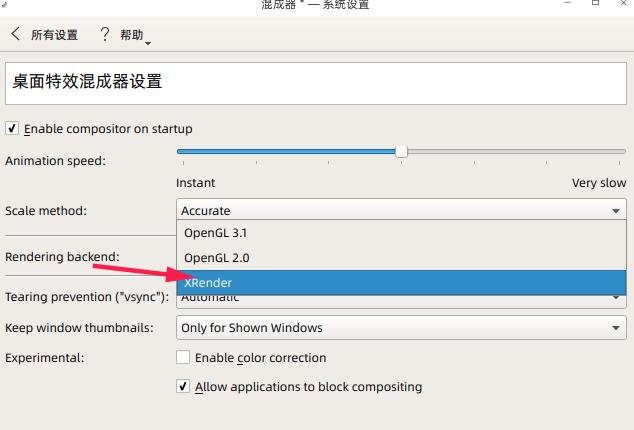

有关deepin的问题跟进反馈：
https://github.com/linuxdeepin/internal-discussion/issues/


# deepin 关闭刺耳的主板蜂鸣器报警声（beep）

**问题描述**：有时候在vim或者终端中，按backspace或table等键时，会突然发出刺耳的“嘟”声音，且尝试关闭时，发现即使关闭系统声音，仍然会出现。

**解决**：这不是扬声器声音，而是主板上的蜂鸣器发出的警报声。  
Windows系统下，需要到设备管理器->隐藏设备->找到beep，禁止即可。  
Linux下，则需要手动修改配置。
root账户权限， `vim ~/.bashrc` 
在末尾添加这两行，

``` 
setterm -blength 0
xset -b
```

保存退出。
重启系统即可。

# deepin 软件窗口标题栏高度太高，不协调

项目issue已经有很多人反应，后期版本应该会有更新。

## 方法一：缺陷是右侧的小按钮会比较小。

创建目录(默认是浅色主题，如果是黑色，则改为dark)
`mkdir -p ~/.local/share/deepin/themes/deepin/light/` 

在该目录下，创建新的文件，直接运行
`vim titlebar.ini` 
加入高度配置

``` 
[Active]
height=25

[Inactive]
height=25
```

保存，退出。
注销或重启生效。

## 方法二：修改gtk样式配置

待验证，有风险，不推荐。

# 内核固件升级相关：解决花屏显示、网卡不能识别等硬件类的问题

## 1、升级内核

### 升级
通过软件库精准选择：
参考 https://www.jianshu.com/p/242d01acfa7d

1. uname -a查看当前系统内容。

> deepin15.11对应的默认内核版本4.15，当前最新v5.4.x

2. 到仓库选择需要的版本：

http://kernel.ubuntu.com/~kernel-ppa/mainline/
下载以下四个包。注意amd是指电脑处理器64位，而非特指amd处理器。
放到一个目录下，打开终端，进入该目录运行
`sudo dpkg -i *.deb` (也可以直接双击，调用深度安装包程序进行安装。)

``` 
linux-headers-xxx_all.deb（内核头文件包1）、
linux-headers-xxx-generic_xxx_amd64.deb（内核头文件包2）
linux-image-unsigned-xxx-generic_xxx_amd64.deb（内核镜像包）、
linux-modules-xxx-generic_xxx_amd64.deb（内核驱动包）、
```

3. 安装完成，保险起见，手动 `sudo update-grub` 
4. 重启，再次使用uname -a查看，新内核已生效。

### 删除多余内核

1. 查看当前系统安装的内核

`dpkg --get-selections | grep linux ` 

``` 
deepin@deepin-PC:~$ dpkg --get-selections| grep linux
libselinux1:amd64				install
libselinux1:i386				install
linux-base					install
linux-firmware					install
linux-headers-4.15.0-30deepin			install
linux-headers-4.15.0-30deepin-generic		install
linux-headers-5.5.0-050500rc5			install
linux-headers-5.5.0-050500rc5-generic		install
linux-headers-deepin-amd64			install
linux-image-deepin-amd64			install
linux-image-unsigned-4.15.0-30deepin-generic	install
linux-image-unsigned-5.5.0-050500rc5-generic	install
linux-libc-dev:amd64				install
linux-modules-4.15.0-30deepin-generic		install
linux-modules-5.5.0-050500rc5-generic		install
linux-modules-extra-4.15.0-30deepin-generic	install
pptp-linux					install
util-linux					install
deepin@deepin-PC:~$ 

```

2. 卸载内核

比如出现问题，需要卸载新安装的5.5内核。

``` 
sudo apt-get remove --purge linux-headers-5.5.0-*

sudo apt-get remove --purge linux-image-5.5.0-*-generic
```

## 2、升级固件

> 注意：可能会提示缺失dde、playmouth等，根据提示使用 `apt install 相应的名称` 即可。

系统固件保存在/lib/firmware/下。

1. 终端执行 `sudo update-initramfs -u` 

根据打印内容，查看缺失的固件。一般是 `Possible missing firmware ×××××××` 

2. 到仓库选择需要的固件包

https://git.kernel.org/pub/scm/linux/kernel/git/firmware/linux-firmware.git/tree
下载对应的包，解压后，将对应的驱动.bin文件复制到/lib/firmware/的目录下即可。

3. 再次运行 `sudo update-initramfs -u` 

4. 重启即可。

# deepin闪屏、花屏问题解决：通过修改kde配置

安装systemsettiings
`apt install systemsettings` 
安装完成后，在启动器会有kde系统设置的图标。打开->显示和监视->后端渲染改为xRender



另外，还可以进行窗口、网络等，更多设置。

# 查看Linux下无线网卡芯片的网站

https://wikidevi.com/wiki/Main_Page

# 出现提示有依赖未安装

"下列软件包有未满足的依赖关系：……"
解决办法：
强制安装
`apt -f install` 
或者卸载出错的安装
`apt purge 包名` 

