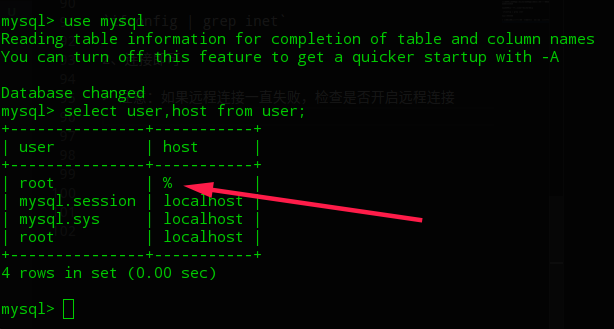

# 安装Docker及MySQL（5.7）基本配置
1、deepin安装docker  
安装：`apt install docker.io`  
检验是否成功： `docker -v` 

2、解决docker pull镜像过慢的问题（增加国内源）

在/etc/docker目录下的daemon.json（没有则新建），增加如下内容
```
    {
      "registry-mirrors": ["https://registry.docker-cn.com"]
    }
````
或中科大的源：https://docker.mirrors.ustc.edu.cn

保存退出后，重启docker服务。

`systemctl restart docker`

3、docker pull下载的镜像位置在本机
/var/lib/docker下，有containers、image等目录。

4、开启容器

注意：本地宿主机已经运行MySQL或其他服务，会导致3306端口冲突，需要修改映射。其中，*容器内部的端口只能是3306，这是mysql的默认端口*，除非你改mysql镜像的Dockerfile。
```
sudo docker run --name mysql57 -e MYSQL_ROOT_PASSWORD=123456 -p 33060:3306 -d mysql:5.7
```

5、进入容器（类似进入虚拟机Linux系统，进入后操作与Linux本机类似）

`docker exec -it mysql15(也可以是通过docker ps查看得到的container id)  bash`

> ctrl d 退出

6、进入MySQL

`mysql -uroot -p123456`
可正常进入。

7、字符集问题

从docker镜像中pull的MySQL镜像，默认字符编码是latin，涉及到中文会有乱码。

修改docker下mysql容器的字符集配置，  
`vim /etc/mysql/conf.d/mysql.conf`  
添加如下内容
```
[client]
default-character-set=utf8

[mysql]
default-character-set=utf8

[mysqld]
init_connect='SET collation_connection = utf8_unicode_ci'
init_connect='SET NAMES utf8'
character-set-server=utf8
collation-server=utf8_unicode_ci
skip-character-set-client-handshake
```

保存退出。另一个终端，重启docker容器。  

`docker restart mysql57`

然后再进入mysql -uroot -p123456
查看字符集，发现已经修改为utf8。

```
>show variables like 'character%';
>show variables like 'collation%';
```

>注意：默认vim没有安装，需要手动安装，也可以拷贝到宿主机中修改完成后再传回docker容器。此次是直接在容器中安装vim。
```
apt-get update
apt-get install vim
```
>安装完成，即可正常使用vim编辑配置

关于字符集更加详细的说明，可看这篇文章
https://www.jianshu.com/p/cd7a7ad8ce52

# 连接docker中的MySQL容器

>注意这里的地址是docker的地址，端口是之前配置的本地映射端口33060

1、首先通过宿主机查看docker的ip

`ifconfig | grep inet`

2、连接即可

> 注意：如果远程连接一直失败，检查是否开启远程连接



此时root账户已经设置为允许所有。还可以更加针对性配置，以提高安全性。

运行如下命令

1、进入mysql  
`mysql -u root -p`

2、对账户和ip访问授权

`GRANT ALL PRIVILEGES ON *.* TO root@"%" IDENTIFIED BY "123456";`

3、刷新权限

`flush privileges;`

# docker 常用命令

新建容器

docker run -d --name 自定义容器名 镜像ID或镜像名

展示当前运行的容器

docker ps

展示所有容器

docker ps -a

展示所有本地镜像

docker images

运行容器

docker start 容器名或容器ID

停止运行容器

docker stop 容器名或容器ID

删除容器

docker rm -f 容器名或容器ID

进入容器内容bash

docker exec -it 容器名或容器ID bash
#退出容器命令:exit

关闭docker服务

systemctl stop docker


