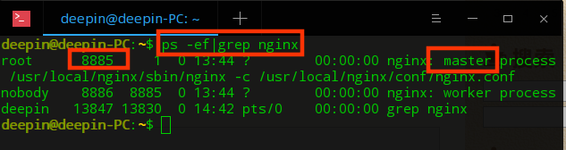

> 注意：所有操作需要root用户下，或使用sudo
否则可能会出现各种报错


## 1 nginx的安装配置（linux环境下）
官网链接：http://nginx.org/en/download.html


此处使用稳定版1.16.1

### 1 安装相关的依赖库

``` 
# 安装gcc g++的依赖库
sudo apt-get install build-essential
sudo apt-get install libtool

# 安装pcre依赖库
sudo apt-get install libpcre3 libpcre3-dev

# 安装zlib依赖库
sudo apt-get install zlib1g-dev

# 安装ssl依赖库
sudo apt-get install openssl
```

### 2 下载源码编译安装

``` 
# 下载（此处切入到usr/local/src目录下）
`sudo wget http://nginx.org/download/nginx-1.16.1.tar.gz` 

# 解压
sudo tar -zxvf nginx-1.16.1.tar.gz

# 在 /usr/local/ 目录下创建nginx目录,用于存放编译后的nginx
sudo mkdir nginx

# 配置（切到/usr/src/nginx-1.16.1目录下）
sudo ./configure --prefix=/usr/local/nginx
# 编译
sudo make
# 安装
sudo make install

```

### 3 启动和验证

**启动nginx**
`sudo /usr/local/nginx/sbin/nginx -c /usr/local/nginx/conf/nginx.conf` 
***注意：-c 指定配置文件的路径，不加的话，nginx会自动加载默认路径的配置文件，可以通过 -h查看帮助命令。***

也可以自行指定配置文件

``` 
server {
listen       9090;                   #开放的端口
server_name  localhost 127.0.0.1;    #设置本地的地址

#charset koi8-r;

#access_log  logs/host.access.log  main;

    location / {
    root   D:/emmacode/emmaAdmin/dist; #设置要访问的文件夹 要注意是“/”
    index  index.html index.htm;       #默认打开的文件
    }
}
```

**查看nginx进程：**
`ps -ef|grep nginx` 

**验证是否成功**
访问localhost，显示欢迎页


## 2 编译错误的问题解决

### 1 依赖库安装不全

### 2 Makefile校错机制

需要修改 /usr/local/nginx/nginx-1.16.1/objs/Makefile中，找到 -Werrori并去掉再重新make即可。 -Werrori意思之后 发现原来它要求GCC将所有的警告当成错误进行处理 所有导致错误输出 并不能进行下一步。

## 3 添加到系统服务nginx.service

`/usr/local/nginx/sbin/nginx` , 不加-c参数，会自动加载默认路径的配置启动。所以接下来自定义配置启动命令。

1. 在系统服务目录里创建nginx.service文件

`sudo vim /lib/systemd/system/nginx.service` 

2. 添加配置

``` 
[Unit]
Description=nginx
After=network.target
  
[Service]
Type=forking
ExecStart=/usr/local/nginx/sbin/nginx
ExecReload=/usr/local/nginx/sbin/nginx -s reload
ExecStop=/usr/local/nginx/sbin/nginx -s quit
PrivateTmp=true
  
[Install]
WantedBy=multi-user.target
```

3. 可以使用systemctl进行控制了

启动：
`systemctl start nginx.service` 

## 4 nginx的启动、停止、重启

### 4.1 启动
`/usr/local/nginx/sbin/nginx -c /usr/local/nginx/conf/nginx.conf` 

### 4.2 停止

(若配置过系统service服务，则可以直接通过systemctl status/start/stop nginx.service进行控制)

主要有三种方式

#### 4.2.1 从容停止

1、查看进程号
`ps -ef|grep nginx` 



2、杀死进程
`sudo kill -QUIT 8885` 

#### 4.2.2 快速停止

1、查看进程号
`进程号为14278` 

2、杀死进程
`kill -TERM 14278` 或 `kill -INT 14278` 

#### 4.2.3 强制停止

`pkill -9 nginx` 


### 4.3 重启

#### 4.3.1 验证nginx配置文件是否正确
进入nginx安装目录的sbin下，输入命令./nginx -t


#### 4.3.2 重启nginx服务
法1：进入nginx可执行目录sbin下，输入命令
`./nginx -s reload`
法2：查看当前nginx进程号，然后输入命令
`kill -HUP`


## 参考文章

安装配置：https://blog.csdn.net/a_little_snail/article/details/78040284?utm_source=blogxgwz8
添加系统服务：https://www.cnblogs.com/piscesLoveCc/p/5867900.html

