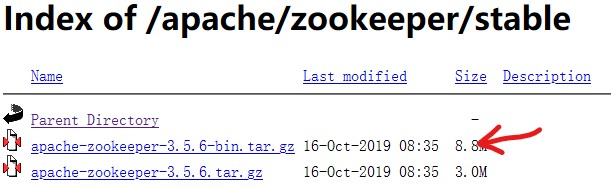
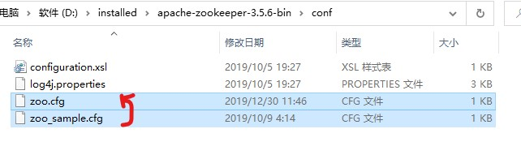
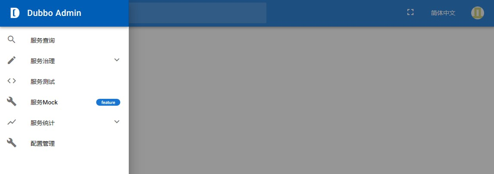

# 一、搭建zookeeper注册中心
以windows平台为例，Linux类似。
首先下载zookeeper文件。
最新版本的相比之前老版本有许多需要注意的坑点。  
http://mirror.bit.edu.cn/apache/zookeeper/stable/

## 坑1：下载哪一个？

下载文件选择带有bin的。



## 坑2：端口占用问题？

下载完成后，解压，得到apache-zookeeper-3.5.6-bin。 

在该目录下新建data文件夹，作为数据存放是目录。

进入conf目录，进行初始的配置。
将原来的示例zoo_sample.cfg重命名或者是复制一份命名为zoo.cfg



打开zoo.cfg，修改dataDir为指定的data目录 `dataDir=../data` 

**注意：zookeeper2.5版本后，会有个admin.serverPort默认占用8080端口，所以会导致启动dubbo等项目时，会报错端口被占用。所以此处指定一个端口**

在zoo.cfg文件最后添加一行 `admin.serverPort=8888` 
保存，退出即可。

## 本地启动和简单操作

进入bin目录，cmd下，运行zkServer.cmd，启动服务端；
运行zkCli.cmd，启动客户端。

运行 `ls /` 查看根目录下的节点，还有set、get等命令。

# 二、 Dubbo admin下载和安装

新版的Dubbo目录有些变动，分为前端vue和后端server部分。需要分别进行配置。
注意：启动dubbo admin之前，保持zookeeper处于开启状态。

## 下载

https://github.com/apache/dubbo-admin
下载压缩包，解压。得到dubbo-admin-develop

## 配置后端部分

（需要使用maven命令构建，所以需要提前配好maven及环境变量。）

1. 检查配置文件中zookeeper的地址配置

进入dubbo-admin-server目录下，检查
src\main\resources下的application.properties文件中，zookeeper的配置是否正确。

``` 
admin.registry.address=zookeeper://127.0.0.1:2181
admin.config-center=zookeeper://127.0.0.1:2181
admin.metadata-report.address=zookeeper://127.0.0.1:2181
```

确认无误。

2. 生成jar包

到dubbo-admin-server目录下，运行cmd命令。 `mvn clean package` 
在当前目录下会生成target目录，其中有
dubbo-admin-server-0.1.jar文件。

3. 启动项目

方法1：cmd运行命令 `mvn --projects dubbo-admin-server spring-boot:run ` 
方法2：进入到target目录，cmd运行命令 `java -jar dubbo-admin-server-0.1.jar` 

项目后端启动完成。

## 配置前端部分

由于使用了vue，所以需要配置node.js。配置好后，进行，dubbo下的相关初始配置。

1. 添加镜像

进入dubbo-admin-develop下的dubbo-admin-ui，打开pom.xml文件，在build中加入。
（原因参考：https://blog.csdn.net/lemon_enir/article/details/94735704

``` 
                    <execution>
                        <id>install node and npm</id>
                        <goals>
                            <goal>install-node-and-npm</goal>
                        </goals>
                        <configuration>
                            <nodeVersion>v9.11.1</nodeVersion>
							<!--加入淘宝的镜像-->							
							<downloadRoot>http://npm.taobao.org/mirrors/node/</downloadRoot>
                        </configuration>
                    </execution>
```

2. 运行npm

在dubbo-admin-ui目录下，运行cmd命令。
运行 `npm install` 
安装完成，启动项目 `npm run dev` 

3. 浏览器访问

localhost:8081/
默认用户名密码均为root



