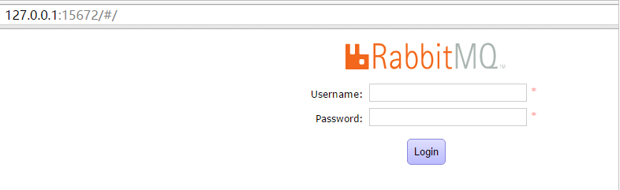
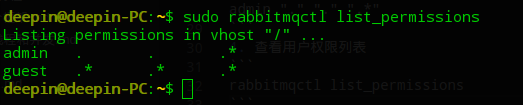

## 1 安装（过程略）

### 1.1 linux

### 1.2 windows

### 1.3 docker

安装完成后，运行命令 `rabbitmq-plugins enable rabbitmq_management` 启用web页面管理插件.

访问127.0.0.1:15672

默认账号名密码均为guest



## 2 添加用户、设置vhost（可理解为数据库）、设置权限

### 2.1 添加admin用户
可以通过界面的Admin按钮添加，也可以通过命令行设置。
命令行示例：

1. 创建用户：用户名是user_mmr,密码是123456

``` 
rabbitmqctl add_user user_mmr 123456 
```

2. 设置为管理员

``` 
rabbitmqctl set_user_tags admin administrator
```

3. 设置读写权限

``` 
rabbitmqctl set_permissions -p / user_mmr "." "." ".*"
``` 

4. 查看用户权限列表

```

rabbitmqctl list_permissions
```



### 2.2 用户角色


1、超级管理员(administrator)
可登陆管理控制台，可查看所有的信息，并且可以对用户，策略(policy)进行操作。
2、监控者(monitoring)
可登陆管理控制台，同时可以查看rabbitmq节点的相关信息(进程数，内存使用情况，磁盘使用情况等)
3、策略制定者(policymaker)
可登陆管理控制台, 同时可以对policy进行管理。但无法查看节点的相关信息(上图红框标识的部分)。
4、普通管理者(management)
仅可登陆管理控制台，无法看到节点信息，也无法对策略进行管理。
5、其他
无法登陆管理控制台，通常就是普通的生产者和消费者。

