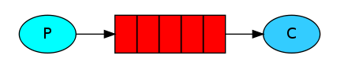
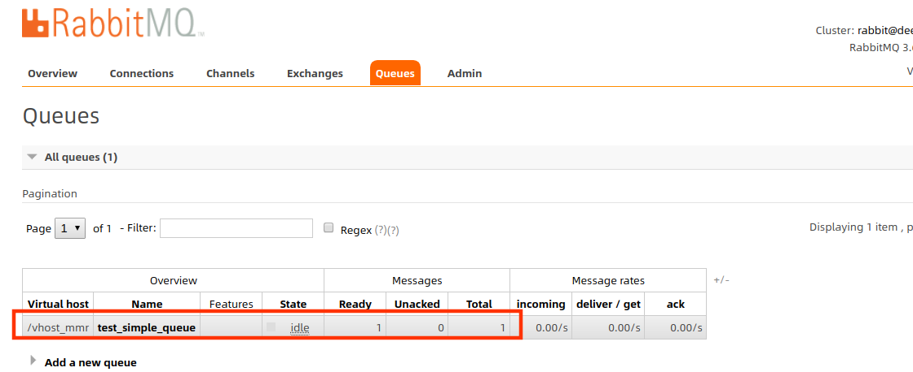
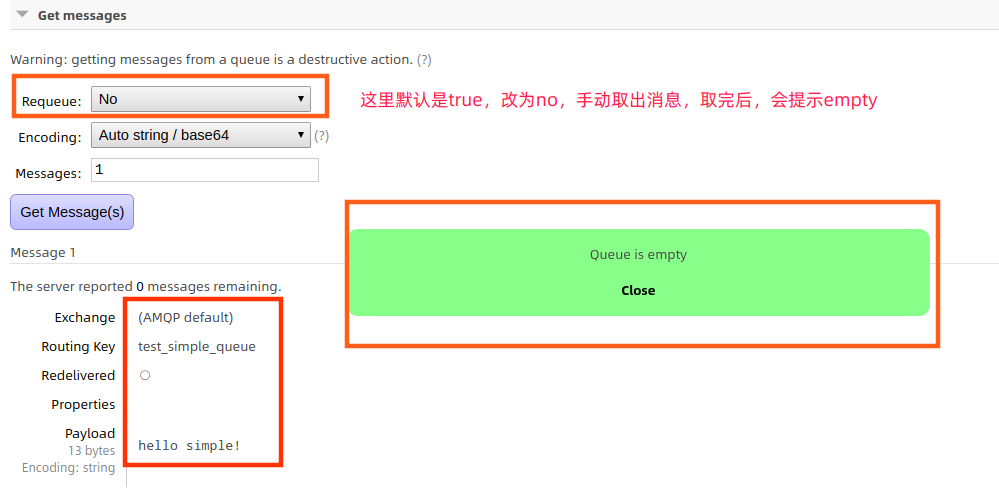

>官方文档示例的pom依赖
https://github.com/rabbitmq/rabbitmq-tutorials/blob/master/java-mvn/pom.xml

``` xml
<project xmlns="http://maven.apache.org/POM/4.0.0" xmlns:xsi="http://www.w3.org/2001/XMLSchema-instance"
         xsi:schemaLocation="http://maven.apache.org/POM/4.0.0 https://maven.apache.org/xsd/maven-4.0.0.xsd">
    <modelVersion>4.0.0</modelVersion>

    <groupId>com.rabbitmq</groupId>
    <artifactId>rabbitmq-tutorial</artifactId>
    <version>1.0-SNAPSHOT</version>
    <packaging>jar</packaging>

    <name>rabbitmq-tutorial</name>
    <url>https://github.com/rabbitmq/rabbitmq-tutorials</url>

    <properties>
        <project.build.sourceEncoding>UTF-8</project.build.sourceEncoding>
        <maven.compiler.source>1.8</maven.compiler.source>
        <maven.compiler.target>1.8</maven.compiler.target>
    </properties>

    <dependencies>
        <dependency>
            <groupId>com.rabbitmq</groupId>
            <artifactId>amqp-client</artifactId>
            <version>5.7.1</version>
        </dependency>
        <dependency>
            <groupId>org.slf4j</groupId>
            <artifactId>slf4j-simple</artifactId>
            <version>1.7.26</version>
        </dependency>

        <dependency>
            <groupId>org.junit.jupiter</groupId>
            <artifactId>junit-jupiter</artifactId>
            <version>5.5.1</version>
            <scope>test</scope>
        </dependency>

        <dependency>
            <groupId>io.dropwizard.metrics</groupId>
            <artifactId>metrics-core</artifactId>
            <version>4.1.0</version>
            <scope>test</scope>
        </dependency>

        <dependency>
            <groupId>org.assertj</groupId>
            <artifactId>assertj-core</artifactId>
            <version>3.13.2</version>
            <scope>test</scope>
        </dependency>

        <dependency>
            <groupId>org.mockito</groupId>
            <artifactId>mockito-core</artifactId>
            <version>3.0.0</version>
            <scope>test</scope>
        </dependency>

    </dependencies>

    <build>
        <plugins>
            <plugin>
                <artifactId>maven-compiler-plugin</artifactId>
                <version>3.8.1</version>
            </plugin>
            <plugin>
                <artifactId>maven-surefire-plugin</artifactId>
                <version>2.22.2</version>
            </plugin>
        </plugins>
    </build>

</project>
```

## 简单队列示例

> In the diagram below, "P" is our producer and "C" is our consumer. The box in the middle is a queue - a message buffer that RabbitMQ keeps on behalf of the consumer.



### 1.1 创建工具类，用户获取Connection连接

``` JAVA
package com.mmr.rabbitmq.util;

import com.rabbitmq.client.Connection;
import com.rabbitmq.client.ConnectionFactory;

import java.io.IOException;
import java.util.concurrent.TimeoutException;

/**
 * 获取mq的连接
 *
 * @author panda00hi
 * 2020/3/30
 */
public class ConnectionUtils {
    public static Connection getConnection() throws IOException, TimeoutException {

        // 定义一个连接工厂
        ConnectionFactory factory = new ConnectionFactory();
        // 设置服务地址
        factory.setHost("127.0.0.1");
        // amqp端口
        factory.setPort(5672);
        // vhost、用户名、密码
        factory.setVirtualHost("/vhost_mmr");
        factory.setUsername("user_mmr");
        factory.setPassword("123456");
        return factory.newConnection();
    }
}
```

### 1.2 生产者向队列中发送消息

``` JAVA
package com.mmr.rabbitmq.simple;

import com.mmr.rabbitmq.util.ConnectionUtils;
import com.rabbitmq.client.Channel;
import com.rabbitmq.client.Connection;

import java.io.IOException;
import java.util.concurrent.TimeoutException;

/**
 * 发送消息
 *
 * @author panda00hi
 * 2020/3/30
 */
public class Send {
    private static final String QUEUE_NAME = "test_simple_queue";

    public static void main(String[] args) throws IOException, TimeoutException {
        // 获取一个连接
        Connection connection = ConnectionUtils.getConnection();
        // 从连接中获取一个通道
        Channel channel = connection.createChannel();
        // 创建队列的声明
        channel.queueDeclare(QUEUE_NAME, false, false, false, null);
        String msg = "hello simple!";
        channel.basicPublish("", QUEUE_NAME, null, msg.getBytes());

        System.out.println("---send msg:" + msg);
        channel.close();
        connection.close();
    }
}
```

运行可以在web管理界面看到



点击获取，达到总量后，会提示队列为空。



### 1.3 消费者从队列中获取消息

``` JAVA
package com.mmr.rabbitmq.simple;

import com.mmr.rabbitmq.util.ConnectionUtils;
import com.rabbitmq.client.*;

import java.io.IOException;
import java.nio.charset.StandardCharsets;
import java.util.concurrent.TimeoutException;

/**
 * 消费者获取消息
 *
 * @author panda00hi
 * 2020/3/30
 */
public class Recv {

    private static final String QUEUE_NAME = "test_simple_queue";

    public static void main(String[] args) throws IOException, TimeoutException {
        // 获取到连接以及mq通道
        Connection connection = ConnectionUtils.getConnection();
        // 从连接中创建通道
        Channel channel = connection.createChannel();
        // 声明队列
        channel.queueDeclare(QUEUE_NAME, false, false, false, null);

        // 新的api，基于事件驱动
        // 定义消费者
        DefaultConsumer consumer = new DefaultConsumer(channel) {
            // 获取到达的消息
            @Override
            public void handleDelivery(String consumerTag, Envelope envelope, AMQP.BasicProperties properties, byte[] body) throws IOException {
                String msg = new String(body, StandardCharsets.UTF_8);
                System.out.println("new API recv:" + msg);
            }
        };

        // 监听队列
        channel.basicConsume(QUEUE_NAME, true, consumer);

        // 官方示例代码
        /*System.out.println(" [*] Waiting for messages. To exit press CTRL+C");

        DeliverCallback deliverCallback = (consumerTag, delivery) -> {
            String message = new String(delivery.getBody(), "UTF-8");
            System.out.println(" [x] Received '" + message + "'");
        };
        channel.basicConsume(QUEUE_NAME, true, deliverCallback, consumerTag -> {
        });*/
    }

}
```

运行，会处于阻塞状态，当生产者产生消息时，消费者会获取到。

> 注意旧版本的QueueingConsumer方法已过时。需要使用高版本的jar。参考官方文档的例子 https://www.rabbitmq.com/tutorials/tutorial-one-java.html

### 关于老版本的QueueingConsumer废止的原因

``` Java

import com.zpc.rabbitmq.util.ConnectionUtil;

import com.rabbitmq.client.Channel;
import com.rabbitmq.client.Connection;
import com.rabbitmq.client.QueueingConsumer;

public class Recv {

    private final static String QUEUE_NAME = "q_test_01";

    public static void main(String[] argv) throws Exception {

        // 获取到连接以及mq通道
        Connection connection = ConnectionUtil.getConnection();
        // 从连接中创建通道
        Channel channel = connection.createChannel();
        // 声明队列
        channel.queueDeclare(QUEUE_NAME, false, false, false, null);

        // 定义队列的消费者
        QueueingConsumer consumer = new QueueingConsumer(channel);

        // 监听队列
        channel.basicConsume(QUEUE_NAME, true, consumer);

        // 获取消息
        while (true) {
            QueueingConsumer.Delivery delivery = consumer.nextDelivery();
            String message = new String(delivery.getBody());
            System.out.println(" [x] Received '" + message + "'");
        }
    }
}
```

这个应该是5.x之前的经典写法。但是在4.x的版本QueueingConsumer被标记废止5.x被移除。移除的原因是什么呢？

原来QueueingConsumer内部用LinkedBlockingQueue来存放消息的内容，而LinkedBlockingQueue：一个由链表结构组成的有界队列，照先进先出的顺序进行排序 ，未指定长度的话，默认 此队列的长度为Integer. MAX_VALUE，那么问题来了，如果生产者的速度远远大于消费者的速度，也许没等到队列阻塞的条件产生（长度达到Integer. MAX_VALUE）内存就完蛋了，在老的版本你可以通过设置 rabbitmq的prefetch属性channel.basicQos(prefetch)来处理这个问题如果不设置可能出现内存问题（比如因为网络问题只能向rabbitmq生产不能消费，消费者恢复网络之后就会有大量的数据涌入，出现内存问题, oom fgc等）。

而且最上面的写法很不合理不符合事件驱动，什么时候停止while循环也不能写的很优雅，所以在更高的版本直接被移除。取而代之的是DefaultConsumer，你可以通过扩展DefaultConsumer来实现消费者.

> 参考文章：https://www.cnblogs.com/nfsnyy/p/12264590.html

## 简单队列的不足
耦合性高。生产者-消费者一一对应。队列名变更，需要同时变更。