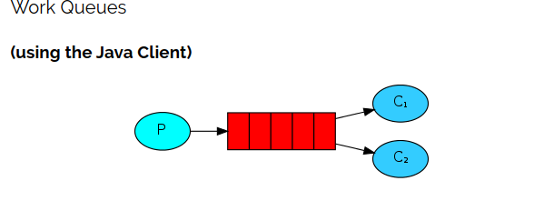

## 简介



一个生产者、2个消费者。
一个消息只能被一个消费者获取。

## 1 轮询分发

### 1.1 生产者

``` JAVA
package com.mmr.rabbitmq.work;

import com.mmr.rabbitmq.util.ConnectionUtils;
import com.rabbitmq.client.Channel;
import com.rabbitmq.client.Connection;

import java.io.IOException;
import java.util.concurrent.TimeUnit;
import java.util.concurrent.TimeoutException;

/**
 * @author panda00hi
 * 2020/3/30
 */
public class Send {

    private static final String QUEUE_NAME = "test_work_queue";

    public static void main(String[] args) throws IOException, TimeoutException, InterruptedException {
        // 获取连接
        Connection connection = ConnectionUtils.getConnection();
        // 创建channel
        Channel channel = connection.createChannel();
        // 声明队列
        channel.queueDeclare(QUEUE_NAME, false, false, false, null);

        for (int i = 0; i < 50; i++) {
            String msg = "hello " + i;
            System.out.println("work queue Send: " + msg);
            channel.basicPublish("", QUEUE_NAME, null, msg.getBytes());
            Thread.sleep(i * 20);
        }

        channel.close();
        connection.close();

    }
}

```

### 1.2 消费者

消费者1消费速度比消费者2速度慢。

消费者1：

``` JAVA
package com.mmr.rabbitmq.work;

import com.mmr.rabbitmq.util.ConnectionUtils;
import com.rabbitmq.client.*;

import java.io.IOException;
import java.nio.charset.StandardCharsets;
import java.util.concurrent.TimeoutException;

/**
 * 消费者1
 *
 * @author panda00hi
 * 2020/3/30
 */
public class Recv1 {
    
    private static final String QUEUE_NAME = "test_work_queue";

    public static void main(String[] args) throws IOException, TimeoutException {

        // 获取到连接以及channel通道
        Connection connection = ConnectionUtils.getConnection();
        Channel channel = connection.createChannel();
        // 声明队列
        channel.queueDeclare(QUEUE_NAME, false, false, false, null);
        // 定义一个消费者
        DefaultConsumer consumer = new DefaultConsumer(channel) {
            // 消息到达，将触发此方法
            @Override
            public void handleDelivery(String consumerTag, Envelope envelope, AMQP.BasicProperties properties, byte[] body) throws IOException {
                String msg = new String(body, StandardCharsets.UTF_8);
                System.out.println("Recv[1] msg: " + msg);
                try {
                    Thread.sleep(2000);
                } catch (InterruptedException e) {
                    e.printStackTrace();
                } finally {
                    System.out.println("[1] done!");
                }
            }
        };

        boolean autoAck = true;
        // 监听
        channel.basicConsume(QUEUE_NAME, autoAck, consumer);
    }
}

```

消费者2：

``` java
package com.mmr.rabbitmq.work;

import com.mmr.rabbitmq.util.ConnectionUtils;
import com.rabbitmq.client.*;

import java.io.IOException;
import java.nio.charset.StandardCharsets;
import java.util.concurrent.TimeoutException;

/**
 * 消费者1
 *
 * @author panda00hi
 * 2020/3/30
 */
public class Recv2 {
    private static final String QUEUE_NAME = "test_work_queue";
    public static void main(String[] args) throws IOException, TimeoutException {
        
        // 获取到连接以及channel通道
        Connection connection = ConnectionUtils.getConnection();
        Channel channel = connection.createChannel();
        // 声明队列
        channel.queueDeclare(QUEUE_NAME, false, false, false, null);
        // 定义一个消费者
        DefaultConsumer consumer = new DefaultConsumer(channel) {
            // 消息到达，将触发此方法
            @Override
            public void handleDelivery(String consumerTag, Envelope envelope, AMQP.BasicProperties properties, byte[] body) throws IOException {
                String msg = new String(body, StandardCharsets.UTF_8);
                System.out.println("Recv[2] msg: " + msg);
                try {
                    // 模拟处理时间，1秒。（比消费者[1]快）
                    Thread.sleep(1000);
                } catch (InterruptedException e) {
                    e.printStackTrace();
                } finally {
                    System.out.println("[2] done!");
                }
            }
        };

        boolean autoAck = true;
        // 监听
        channel.basicConsume(QUEUE_NAME, autoAck, consumer);
    }
}

```

## 轮询分发现象

消费者1和消费者2处理的信息是一样的。
消费者1：偶数
消费者2：奇数

1、消费者1和消费者2获取到的消息内容是不同的，同一个消息只能被一个消费者获取。
2、消费者1和消费者2获取到的消息的数量是相同的，一个是消费奇数号消息，一个是偶数。

rabbitmq默认将消息顺序发送给下一个消费者，这样每个消费者会得到相同数量的消息，即轮询分发 `(round robin)` 。

这样其实是不合理的，处理速度快的消费者，没有获得更多的消息。如何按照消费者能力分配呢？

## 2 使用basicQos实现公平分发

> 注意：使用公平分发，必须关闭自动应答，改为手动应答。

### 2.1 Qos和Acknowledge

basicQos 方法设置了当前信道最大预获取（prefetch）消息数量为1。消息从队列异步推送给消费者，消费者的 ack 也是异步发送给队列，从队列的视角去看，总是会有一批消息已推送但尚未获得 ack 确认，Qos 的 prefetchCount 参数就是用来限制这批未确认消息数量的。设为1时，队列只有在收到消费者发回的上一条消息 ack 确认后，才会向该消费者发送下一条消息。prefetchCount 的默认值为0，即没有限制，队列会将所有消息尽快发给消费者。

### 2.2 两个概念

* 轮询分发 ：使用任务队列的优点之一就是可以轻易的并行工作。如果我们积压了好多工作，我们可以通过增加工作者（消费者）来解决这一问题，使得系统的伸缩性更加容易。在默认情况下，RabbitMQ将逐个发送消息到在序列中的下一个消费者(而不考虑每个任务的时长等等，且是提前一次性分配，并非一个一个分配)。平均每个消费者获得相同数量的消息。这种方式分发消息机制称为Round-Robin（轮询）。

* 公平分发 ：虽然上面的分配法方式也还行，但是有个问题就是：比如：现在有2个消费者，所有的奇数的消息都是繁忙的，而偶数则是轻松的。按照轮询的方式，奇数的任务交给了第一个消费者，所以一直在忙个不停。偶数的任务交给另一个消费者，则立即完成任务，然后闲得不行。而RabbitMQ则是不了解这些的。这是因为当消息进入队列，RabbitMQ就会分派消息。它不看消费者为应答的数目，只是盲目的将消息发给轮询指定的消费者。

为了解决这个问题，我们使用basicQos( prefetchCount = 1)方法，来限制RabbitMQ只发不超过1条的消息给同一个消费者。当消息处理完毕后，有了反馈，才会进行第二次发送。

## 3 work模式的“能者多劳”（也叫公平分发）

生产者代码：

``` JAVA
package com.mmr.rabbitmq.work;

import com.mmr.rabbitmq.util.ConnectionUtils;
import com.rabbitmq.client.Channel;
import com.rabbitmq.client.Connection;

import java.io.IOException;
import java.util.concurrent.TimeoutException;

/**
 * @author panda00hi
 * 2020/3/30
 */
public class Send {

    private static final String QUEUE_NAME = "test_work_queue";

    public static void main(String[] args) throws IOException, TimeoutException, InterruptedException {
        // 获取连接
        Connection connection = ConnectionUtils.getConnection();
        // 创建channel
        Channel channel = connection.createChannel();
        // 声明队列
        channel.queueDeclare(QUEUE_NAME, false, false, false, null);

        /*
         * 每个消费者发送确认消息之前，消息队列不发送下一个消息到消费者。一次只处理一个消息
         * 限制发送给同一个消费者不得差超过一条消息
         */
        int prefetchCount = 1;
        channel.basicQos(prefetchCount);

        for (int i = 0; i < 50; i++) {
            String msg = "hello " + i;
            System.out.println("work queue Send: " + msg);
            channel.basicPublish("", QUEUE_NAME, null, msg.getBytes());
            Thread.sleep(i * 5);
        }

        channel.close();
        connection.close();

    }
}

```

消费者1：处理效率高，会消费更多的消息

``` JAVA
package com.mmr.rabbitmq.work;

import com.mmr.rabbitmq.util.ConnectionUtils;
import com.rabbitmq.client.*;

import java.io.IOException;
import java.nio.charset.StandardCharsets;
import java.util.concurrent.TimeoutException;

/**
 * 消费者1
 *
 * @author panda00hi
 * 2020/3/30
 */
public class Recv1 {

    private static final String QUEUE_NAME = "test_work_queue";

    public static void main(String[] args) throws IOException, TimeoutException {

        // 获取到连接以及channel通道
        Connection connection = ConnectionUtils.getConnection();
        // 内部类使用外部变量，不能让变量被修改，强制声明为final
        final Channel channel = connection.createChannel();

        // 声明队列
        channel.queueDeclare(QUEUE_NAME, false, false, false, null);
        // 保证一次只分发一个
        channel.basicQos(1);
        // 定义一个消费者
        DefaultConsumer consumer = new DefaultConsumer(channel) {
            // 消息到达，将触发此方法
            @Override
            public void handleDelivery(String consumerTag, Envelope envelope, AMQP.BasicProperties properties, byte[] body) throws IOException {
                String msg = new String(body, StandardCharsets.UTF_8);
                System.out.println("Recv[1] msg: " + msg);
                try {
                    Thread.sleep(500);
                } catch (InterruptedException e) {
                    e.printStackTrace();
                } finally {
                    System.out.println("[1] done!");
                    // 手动回执
                    channel.basicAck(envelope.getDeliveryTag(), false);
                }
            }
        };
        // 关闭自动应答
        boolean autoAck = false;
        // 监听
        channel.basicConsume(QUEUE_NAME, autoAck, consumer);
    }
}

```

消费者2：

``` JAVA
package com.mmr.rabbitmq.work;

import com.mmr.rabbitmq.util.ConnectionUtils;
import com.rabbitmq.client.*;

import java.io.IOException;
import java.nio.charset.StandardCharsets;
import java.util.concurrent.TimeoutException;

/**
 * 消费者1
 *
 * @author panda00hi
 * 2020/3/30
 */
public class Recv2 {
    private static final String QUEUE_NAME = "test_work_queue";

    public static void main(String[] args) throws IOException, TimeoutException {

        // 获取到连接以及channel通道
        Connection connection = ConnectionUtils.getConnection();
        // 内部类使用外部变量，不能让变量被修改，强制声明为final
        final Channel channel = connection.createChannel();
        // 声明队列
        channel.queueDeclare(QUEUE_NAME, false, false, false, null);
        // 保证一次只分发一个
        channel.basicQos(1);
        // 定义一个消费者
        DefaultConsumer consumer = new DefaultConsumer(channel) {
            // 消息到达，将触发此方法
            @Override
            public void handleDelivery(String consumerTag, Envelope envelope, AMQP.BasicProperties properties, byte[] body) throws IOException {
                String msg = new String(body, StandardCharsets.UTF_8);
                System.out.println("Recv[2] msg: " + msg);
                try {
                    Thread.sleep(1000);
                } catch (InterruptedException e) {
                    e.printStackTrace();
                } finally {
                    System.out.println("[2] done!");
                    // 手动回执
                    channel.basicAck(envelope.getDeliveryTag(), false);
                }
            }
        };
        // 关闭自动应答
        boolean autoAck = false;
        // 监听
        channel.basicConsume(QUEUE_NAME, autoAck, consumer);
    }
}

```
## "能者多劳"现象
消费者1比消费者2获取的消息更多。

