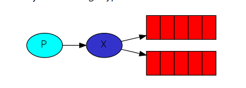

## 发布/订阅模式（Publish/Subscribe）

> The core idea in the messaging model in RabbitMQ is that the producer never sends any messages directly to a queue. Actually, quite often the producer doesn't even know if a message will be delivered to any queue at all.

Instead, the producer can only send messages to an exchange. An exchange is a very simple thing. On one side it receives messages from producers and the other side it pushes them to queues. The exchange must know exactly what to do with a message it receives. Should it be appended to a particular queue? Should it be appended to many queues? Or should it get discarded. The rules for that are defined by the exchange type.



**说明**
之前是生产者发送到消息队列，现在是发送到交换机。

1. 一个生产者，多个消费者
2. 每一个消费者都有自己的队列
3. 生产者没有直接把消息发送到队列，而是发到了交换机，转发器exchange
4. 每个队列都要绑定到交换机上
5. 生产者发送的消息经过交换机 到达队列 就能实现一个消息被多个消费者消费。

应用：注册-》发邮件-》发短信等流程。

## 1 生产者

> 注意：消息发送到没有队列绑定的交换机时，消息将丢失，因为，交换机没有存储消息的能力，消息只能存在在队列中。

``` JAVA
package com.mmr.rabbitmq.ps;

import com.mmr.rabbitmq.util.ConnectionUtils;
import com.rabbitmq.client.Channel;
import com.rabbitmq.client.Connection;

import java.io.IOException;
import java.util.concurrent.TimeoutException;

/**
 * 发布订阅模式的生产者
 *
 * @author panda00hi
 * 2020/3/31
 */
public class Send {

    private static final String EXCHANGE_NAME = "test_exchange_fanout";
    public static void main(String[] args) throws IOException, TimeoutException {
        
        Connection connection = ConnectionUtils.getConnection();
        Channel channel = connection.createChannel();

        // 声明交换机。类型：分发
        channel.exchangeDeclare(EXCHANGE_NAME, "fanout");
        String msg = "hello ps";
        channel.basicPublish(EXCHANGE_NAME, "", null, msg.getBytes());

        System.out.println("Send: " + msg);

        channel.close();
        connection.close();
    }
}
```

## 2 消费者

消费者1：

``` JAVA
package com.mmr.rabbitmq.ps;

import com.mmr.rabbitmq.util.ConnectionUtils;
import com.rabbitmq.client.*;
import java.io.IOException;
import java.nio.charset.StandardCharsets;
import java.util.concurrent.TimeoutException;

/**
 * 发布订阅模式的消费者1
 *
 * @author panda00hi
 * 2020/3/31
 */
public class Recv1 {
    private static final String QUEUE_NAME = "test_queue_fanout_email";
    private static final String EXCHANGE_NAME = "test_exchange_fanout";

    public static void main(String[] args) throws IOException, TimeoutException {

        // 获取到连接以及channel通道
        Connection connection = ConnectionUtils.getConnection();
        // 内部类使用外部变量，不能让变量被修改，强制声明为final
        final Channel channel = connection.createChannel();
        // 声明队列
        channel.queueDeclare(QUEUE_NAME, false, false, false, null);

        // 绑定队列到交换机转发器
        channel.queueBind(QUEUE_NAME, EXCHANGE_NAME, "");

        // 保证一次只分发一个
        channel.basicQos(1);
        // 定义一个消费者
        DefaultConsumer consumer = new DefaultConsumer(channel) {
            // 消息到达，将触发此方法
            @Override
            public void handleDelivery(String consumerTag, Envelope envelope, AMQP.BasicProperties properties, byte[] body) throws IOException {
                String msg = new String(body, StandardCharsets.UTF_8);
                System.out.println("Recv[1] msg: " + msg);
                try {
                    Thread.sleep(500);
                } catch (InterruptedException e) {
                    e.printStackTrace();
                } finally {
                    System.out.println("[1] done!");
                    // 手动回执
                    channel.basicAck(envelope.getDeliveryTag(), false);
                }
            }
        };
        // 关闭自动应答
        boolean autoAck = false;
        // 监听
        channel.basicConsume(QUEUE_NAME, autoAck, consumer);
    }
}
```

消费者2：

``` JAVA
package com.mmr.rabbitmq.ps;

import com.mmr.rabbitmq.util.ConnectionUtils;
import com.rabbitmq.client.*;

import java.io.IOException;
import java.nio.charset.StandardCharsets;
import java.util.concurrent.TimeoutException;

/**
 * 发布订阅模式的消费者1
 *
 * @author panda00hi
 * 2020/3/31
 */
public class Recv2 {
    private static final String QUEUE_NAME = "test_queue_fanout_sms";
    private static final String EXCHANGE_NAME = "test_exchange_fanout";

    public static void main(String[] args) throws IOException, TimeoutException {

        // 获取到连接以及channel通道
        Connection connection = ConnectionUtils.getConnection();
        // 内部类使用外部变量，不能让变量被修改，强制声明为final
        final Channel channel = connection.createChannel();
        // 声明队列
        channel.queueDeclare(QUEUE_NAME, false, false, false, null);

        // 绑定队列到交换机转发器
        channel.queueBind(QUEUE_NAME, EXCHANGE_NAME, "");

        // 保证一次只分发一个
        channel.basicQos(1);
        // 定义一个消费者
        DefaultConsumer consumer = new DefaultConsumer(channel) {
            // 消息到达，将触发此方法
            @Override
            public void handleDelivery(String consumerTag, Envelope envelope, AMQP.BasicProperties properties, byte[] body) throws IOException {
                String msg = new String(body, StandardCharsets.UTF_8);
                System.out.println("Recv[2] msg: " + msg);
                try {
                    Thread.sleep(500);
                } catch (InterruptedException e) {
                    e.printStackTrace();
                } finally {
                    System.out.println("[2] done!");
                    // 手动回执
                    channel.basicAck(envelope.getDeliveryTag(), false);
                }
            }
        };
        // 关闭自动应答
        boolean autoAck = false;
        // 监听
        channel.basicConsume(QUEUE_NAME, autoAck, consumer);
    }
}
```

