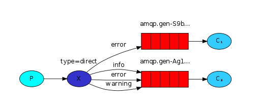

## 路由模式Routing

基于路由键匹配。不同的消费者，绑定到交换机时指定routingKey，获得相匹配的消息。如：生产者发送“error”的通知，c1和c2都能收到通知；生产者发送“info”或“warning”等其他键的通知，c1无法收到，c2可以收到。

实际生产中，可以为不同级别的人提供消息，有的全部群发、有的指定部分群发。



## 1 生产者

``` JAVA
package com.mmr.rabbitmq.routing;

import com.mmr.rabbitmq.util.ConnectionUtils;
import com.rabbitmq.client.Channel;
import com.rabbitmq.client.Connection;

import java.io.IOException;
import java.util.concurrent.TimeoutException;

/**
 * 路由模式生产者
 *
 * @author panda00hi
 * 2020/3/31
 */
public class Send {
    private static final String EXCHANGE_NAME = "test_exchange_direct";

    public static void main(String[] args) throws IOException, TimeoutException {

        Connection connection = ConnectionUtils.getConnection();
        Channel channel = connection.createChannel();

        // exchange
        channel.exchangeDeclare(EXCHANGE_NAME, "direct");

        // 路由键可以写多种：info、error、log等
        // 匹配到的消费着才会接收到对应消息
        String routingKey = "info";

        String msg = "hello direct！routingKey：" + routingKey;
        channel.basicPublish(EXCHANGE_NAME, routingKey, null, msg.getBytes());

        channel.close();
        connection.close();
    }
}
```

## 2 消费者

消费者1：

``` JAVA
package com.mmr.rabbitmq.routing;

import com.mmr.rabbitmq.util.ConnectionUtils;
import com.rabbitmq.client.*;

import java.io.IOException;
import java.nio.charset.StandardCharsets;
import java.util.concurrent.TimeoutException;

/**
 * 路由模式消费者1
 *
 * @author panda00hi
 * 2020/3/31
 */
public class Recv1 {
    private static final String EXCHANGE_NAME = "test_exchange_direct";
    private static final String QUEUE_NAME = "test_queue_direct1";

    public static void main(String[] args) throws IOException, TimeoutException {

        // 获取到连接以及channel通道
        Connection connection = ConnectionUtils.getConnection();
        // 内部类使用外部变量，不能让变量被修改，强制声明为final
        final Channel channel = connection.createChannel();
        // 声明队列
        channel.queueDeclare(QUEUE_NAME, false, false, false, null);

        // 绑定到交换机
        channel.queueBind(QUEUE_NAME, EXCHANGE_NAME, "error");

        // 保证一次只分发一个
        channel.basicQos(1);
        // 定义一个消费者
        DefaultConsumer consumer = new DefaultConsumer(channel) {
            // 消息到达，将触发此方法
            @Override
            public void handleDelivery(String consumerTag, Envelope envelope, AMQP.BasicProperties properties, byte[] body) throws IOException {
                String msg = new String(body, StandardCharsets.UTF_8);
                System.out.println("Recv[1] msg: " + msg);
                try {
                    Thread.sleep(500);
                } catch (InterruptedException e) {
                    e.printStackTrace();
                } finally {
                    System.out.println("[1] done!");
                    // 手动回执
                    channel.basicAck(envelope.getDeliveryTag(), false);
                }
            }
        };
        // 关闭自动应答
        boolean autoAck = false;
        // 监听
        channel.basicConsume(QUEUE_NAME, autoAck, consumer);
    }
}
```

消费者2：

``` JAVA
package com.mmr.rabbitmq.routing;

import com.mmr.rabbitmq.util.ConnectionUtils;
import com.rabbitmq.client.*;

import java.io.IOException;
import java.nio.charset.StandardCharsets;
import java.util.concurrent.TimeoutException;

/**
 * 路由模式消费者2
 *
 * @author panda00hi
 * 2020/3/31
 */
public class Recv2 {
    private static final String EXCHANGE_NAME = "test_exchange_direct";
    private static final String QUEUE_NAME = "test_queue_direct2";

    public static void main(String[] args) throws IOException, TimeoutException {

        // 获取到连接以及channel通道
        Connection connection = ConnectionUtils.getConnection();
        // 内部类使用外部变量，不能让变量被修改，强制声明为final
        final Channel channel = connection.createChannel();
        // 声明队列
        channel.queueDeclare(QUEUE_NAME, false, false, false, null);

        // 绑定到交换机
        channel.queueBind(QUEUE_NAME, EXCHANGE_NAME, "error");
        channel.queueBind(QUEUE_NAME, EXCHANGE_NAME, "info");
        channel.queueBind(QUEUE_NAME, EXCHANGE_NAME, "warning");

        // 保证一次只分发一个
        channel.basicQos(1);
        // 定义一个消费者
        DefaultConsumer consumer = new DefaultConsumer(channel) {
            // 消息到达，将触发此方法
            @Override
            public void handleDelivery(String consumerTag, Envelope envelope, AMQP.BasicProperties properties, byte[] body) throws IOException {
                String msg = new String(body, StandardCharsets.UTF_8);
                System.out.println("Recv[2] msg: " + msg);
                try {
                    Thread.sleep(500);
                } catch (InterruptedException e) {
                    e.printStackTrace();
                } finally {
                    System.out.println("[2] done!");
                    // 手动回执
                    channel.basicAck(envelope.getDeliveryTag(), false);
                }
            }
        };
        // 关闭自动应答
        boolean autoAck = false;
        // 监听
        channel.basicConsume(QUEUE_NAME, autoAck, consumer);
    }
}
```

运行效果:

发送消息的routingKey为"error"时，两个消费者均能消费；
发送"info"消息时，消费者2可以获取到。

Recv1:

``` 
Recv[1] msg: hello direct！routingKey：error
[1] done!

```

Recv2:

``` 
Recv[2] msg: hello direct！routingKey：error
[2] done!
Recv[2] msg: hello direct！routingKey：info
[2] done!
```

