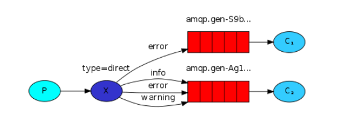
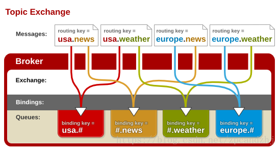

## 主题模式Topics（通配符模式）

同一个消息被多个消费者获取。一个消费者队列可以有多个消费者实例，只有其中一个消费者实例会消费到消息。



将路由键和某模式匹配。

``` 
# 匹配一个或者多个词

* 匹配一个词

```



## 1 生产者

``` JAVA
package com.mmr.rabbitmq.topics;

import com.mmr.rabbitmq.util.ConnectionUtils;
import com.rabbitmq.client.Channel;
import com.rabbitmq.client.Connection;

import java.io.IOException;
import java.util.concurrent.TimeoutException;

/**
 * 主题模式生产者
 *
 * @author panda00hi
 * 2020/3/31
 */
public class Send {

    private static final String EXCHANGE_NAME = "test_exchange_topic";

    public static void main(String[] args) throws IOException, TimeoutException {

        Connection connection = ConnectionUtils.getConnection();
        Channel channel = connection.createChannel();
        // exchange
        channel.exchangeDeclare(EXCHANGE_NAME, "topic");
        String routingKey = "goods.add";
        // String routingKey = "goods.update";
        // String routingKey = "goods.delete";
        String msg = "商品routingKey--" + routingKey;
        channel.basicPublish(EXCHANGE_NAME, routingKey, null, msg.getBytes());

        System.out.println("----send " + msg);

        channel.close();
        connection.close();
    }
}
```

## 2 消费者

消费者1：

``` JAVA
package com.mmr.rabbitmq.topics;

import com.mmr.rabbitmq.util.ConnectionUtils;
import com.rabbitmq.client.*;

import java.io.IOException;
import java.nio.charset.StandardCharsets;
import java.util.concurrent.TimeoutException;

/**
 * 主题模式消费者1
 *
 * @author panda00hi
 * 2020/3/31
 */
public class Recv1 {
    private static final String EXCHANGE_NAME = "test_exchange_topic";
    private static final String QUEUE_NAME = "test_queue_topic1";

    public static void main(String[] args) throws IOException, TimeoutException {

        // 获取到连接以及channel通道
        Connection connection = ConnectionUtils.getConnection();
        // 内部类使用外部变量，不能让变量被修改，强制声明为final
        final Channel channel = connection.createChannel();
        // 声明队列
        channel.queueDeclare(QUEUE_NAME, false, false, false, null);

        // 绑定到交换机
        channel.queueBind(QUEUE_NAME, EXCHANGE_NAME, "goods.add");
        channel.queueBind(QUEUE_NAME, EXCHANGE_NAME, "goods.update");

        // 保证一次只分发一个
        channel.basicQos(1);
        // 定义一个消费者
        DefaultConsumer consumer = new DefaultConsumer(channel) {
            // 消息到达，将触发此方法
            @Override
            public void handleDelivery(String consumerTag, Envelope envelope, AMQP.BasicProperties properties, byte[] body) throws IOException {
                String msg = new String(body, StandardCharsets.UTF_8);
                System.out.println("Recv[1] msg: " + msg);
                try {
                    Thread.sleep(500);
                } catch (InterruptedException e) {
                    e.printStackTrace();
                } finally {
                    System.out.println("[1] done!");
                    // 手动回执
                    channel.basicAck(envelope.getDeliveryTag(), false);
                }
            }
        };
        // 关闭自动应答
        boolean autoAck = false;
        // 监听
        channel.basicConsume(QUEUE_NAME, autoAck, consumer);
    }
}
```

消费者2：

``` JAVA
package com.mmr.rabbitmq.topics;

import com.mmr.rabbitmq.util.ConnectionUtils;
import com.rabbitmq.client.*;

import java.io.IOException;
import java.nio.charset.StandardCharsets;
import java.util.concurrent.TimeoutException;

/**
 * 主题模式消费者2
 *
 * @author panda00hi
 * 2020/3/31
 */
public class Recv2 {
    private static final String EXCHANGE_NAME = "test_exchange_topic";
    private static final String QUEUE_NAME = "test_queue_topic2";

    public static void main(String[] args) throws IOException, TimeoutException {

        // 获取到连接以及channel通道
        Connection connection = ConnectionUtils.getConnection();
        // 内部类使用外部变量，不能让变量被修改，强制声明为final
        final Channel channel = connection.createChannel();
        // 声明队列
        channel.queueDeclare(QUEUE_NAME, false, false, false, null);

        // 绑定到交换机
        channel.queueBind(QUEUE_NAME, EXCHANGE_NAME, "goods.#");

        // 保证一次只分发一个
        channel.basicQos(1);
        // 定义一个消费者
        DefaultConsumer consumer = new DefaultConsumer(channel) {
            // 消息到达，将触发此方法
            @Override
            public void handleDelivery(String consumerTag, Envelope envelope, AMQP.BasicProperties properties, byte[] body) throws IOException {
                String msg = new String(body, StandardCharsets.UTF_8);
                System.out.println("Recv[2] msg: " + msg);
                try {
                    Thread.sleep(500);
                } catch (InterruptedException e) {
                    e.printStackTrace();
                } finally {
                    System.out.println("[2] done!");
                    // 手动回执
                    channel.basicAck(envelope.getDeliveryTag(), false);
                }
            }
        };
        // 关闭自动应答
        boolean autoAck = false;
        // 监听
        channel.basicConsume(QUEUE_NAME, autoAck, consumer);
    }
}
```

运行结果：

``` java
// 绑定到交换机
channel.queueBind(QUEUE_NAME, EXCHANGE_NAME, "goods.add");
channel.queueBind(QUEUE_NAME, EXCHANGE_NAME, "goods.update");
```

Recv1可以收到 "goods.add"、 "goods.update"的消息；
Recv2可以收到 "goods."结尾的所有消息。

