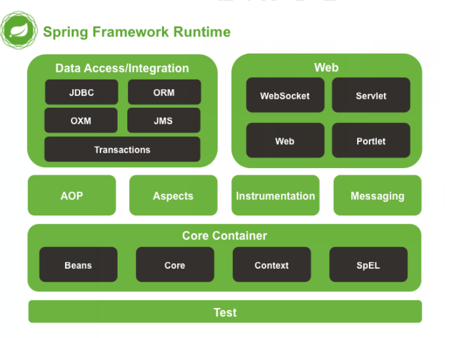

# spring简介
Spring 是于 2003 年兴起的一个轻量级的Java 开发框架，创始人是Rod Johnson，它是为了解决企业应用开发的复杂性而创建的，随着时代的发展，spring旗下发展了很多项目，并且越来越多的开发者开始使用这些项目。spring的优点如下：

* 方便解耦，简化开发（高内聚低耦合），可以将对象依赖关系的维护交给Spring管理。
* IOC（Inversion of Control）控制反转，对象的创建由spring完成，并将创建好的对象注入给使用者。
* AOP（Aspect Orient Programming）编程的支持，面向切面编程，可以将一些日志，事务等操作从业务逻辑的代码中抽取出来，这样子业务逻辑代码就更加纯净了，并且可以增强日志和事务复用性。【日常中三层结构，先写controller，controller调用service，service再调用dao层。面向切面，即面向service层编程，比如加日志、加事务处理，不需要在每个类写，而是通过spring切入到dao层】
* 声明式事务的支持，只需要通过配置就可以完成对事务的管理，而无需手动编程。
* 方便集成各种优秀框架，其内部提供了对很多优秀框架（如：Struts、Hibernate、MyBatis等）的直接支持。
* 非侵入式，spring的api不会在业务逻辑的代码中出现，倘若有一天项目不使用spring了，那么可以很方便的移植到其他框架上。

体系架构


# spring学习要点
springBoot等框架对于spring相当于进行了更加高级的封装，所以使用起来更加方便快捷，但是在工作中使用到的很多点，并不知晓原理，仅仅是会用的程度。因此，对spring的知识进行回顾整理。
总的来说，spring只需注意这三个重点即可：**IOC、AOP、事务控制**。中间还涉及到动态代理等知识，后期有时间再单独整理。

# 第一个spring程序

目录结构

#### 添加依赖jar包

这里使用spring 5.x的版本，要使用该版本的话，需要保证你的jdk是8以上。

要想使用spring框架的话，需要添加相关的jar包，在你的pom.xml文件中添加下面依赖即可：
(保留junit依赖，删掉其他原有自动生成的依赖部分)

``` 
<dependency>
    <groupId>org.springframework</groupId>
    <artifactId>spring-context</artifactId>
    <version>5.0.4.RELEASE</version>
</dependency>
```

#### 创建接口和实现类

创建一个接口和该接口的实现类
StudentService.java

``` 
package com.panda00hi.service;

public interface StudentService {
    void study();
}

```

StudentServiceImpl.java

``` 
package com.panda00hi.service.impl;

import com.panda00hi.service.StudentService;

public class StudentServiceImpl implements StudentService {
    @Override
    public void study() {
        System.out.println("好好学习，天天向上");
    }
}

```

#### 添加spring的配置文件

在maven项目的resources目录下添加spring配置文件，文件名可以随意命名，这里命名为：applicationContext.xml
里面需要添加一些xsd，拷贝下面的即可。

``` 
<beans xmlns="http://www.springframework.org/schema/beans"
   xmlns:xsi="http://www.w3.org/2001/XMLSchema-instance"
   xmlns:aop="http://www.springframework.org/schema/aop"
   xmlns:context="http://www.springframework.org/schema/context"
   xsi:schemaLocation="http://www.springframework.org/schema/beans
    http://www.springframework.org/schema/beans/spring-beans.xsd
    http://www.springframework.org/schema/aop
    http://www.springframework.org/schema/aop/spring-aop.xsd
    http://www.springframework.org/schema/context
    http://www.springframework.org/schema/context/spring-context.xsd">

    <!-- id 不能重复， class不能是接口，必须是实现类-->
    <bean id="studentService" class="com.panda00hi.service.impl.StudentServiceImpl"></bean>

</beans>
```

在该spring配置文件中添加bean标签：

* id：该属性是Bean的唯一标识，java程序通过id访问该Bean。
* class：指定该Bean所属的类，这里只能是类，不能是接口。

#### 创建测试类：

想要使用StudentService的话，需要开发者自己手动通过new关键字创建该接口实现类的对象。虽然使用了接口可以实现程序的解耦，但是实际上在代码中还是有new StudentServiceImpl的语句，这个地方还是存在一些耦合的。

使用spring之后，在代码中通过spring获取StudentServiceImpl对象，这样子就去掉了之前代码中的耦合。

``` 
package com.panda00hi.test;

import com.panda00hi.service.StudentService;
import com.panda00hi.service.impl.StudentServiceImpl;
import org.junit.Test;
import org.springframework.context.ApplicationContext;
import org.springframework.context.support.ClassPathXmlApplicationContext;

public class Test01 {

    /**
     * 以前的写法，需要手动创建对象
     */
    @Test
    public void oldType(){
        StudentServiceImpl studentService = new StudentServiceImpl();
        studentService.study();
    }

    /**
     * 通过spring获取对象
     */
    @Test
    public  void newType(){

        //读取spring配置文件
        ApplicationContext context = new ClassPathXmlApplicationContext("applicationContext.xml");
        //从spring中获取对象
        StudentService studentService = (StudentService) context.getBean("studentService");
        studentService.study();
    }
}

```

通过配置文件Bean中的id，创建相匹配的class对象。

