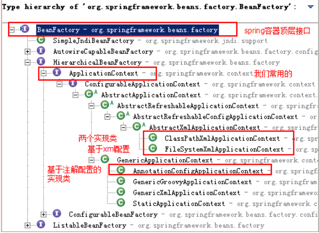
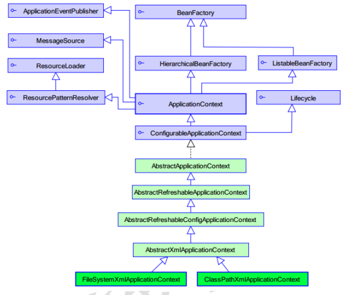

## 1 程序的耦合和解耦

### 1.1 什么是程序的耦合

在软件工程中，耦合指的就是就是对象之间的依赖性。对象之间的耦合越高，维护成本越高。因此对象的设计应使类和构件之间的耦合最小。软件设计中通常用耦合度和内聚度作为衡量模块独立程度的标准。划分模块的一个准则就是==高内聚低耦合。==

在项目开发过程中，常常会有多个层（MVC），多个类间的相互调用，如果都是用new 类名的方式创建实例对象，会导致各个模块间过分依赖。
如：

``` java
/**
 * 账户的业务层实现类
 */
public class AccountServiceImpl implements IAccountService {
private IAccountDao accountDao = new AccountDaoImpl();
}
```

上面的代码表示：
业务层调用持久层，并且此时业务层在依赖持久层的接口和实现类。如果此时没有持久层实现类，编译将不能通过。这种编译期依赖关系，应该在我们开发中杜绝。我们需要优化代码解决。

### 1.2 工厂模式解耦

在实际开发中我们可以把三层的对象都使用配置文件配置起来，当启动服务器应用加载的时候，让一个类中的方法通过读取配置文件，把这些对象创建出来并存起来。在接下来的使用的时候，直接拿过来用就好了。
那么，这个读取配置文件，创建和获取三层对象的类就是工厂

### 1.3 控制反转 Inversion Of Control

把创建对象的权利交给框架，包括依赖注入、依赖查找。

**作用：削减计算机程序的耦合(解除我们代码中的依赖关系)**

工厂模式创建对象的过程： 

1. 用反射的方式创建对象 

bean = Class.forName(beanPath).newInstance(); 

2. 有能反射的全限定类名

accountService = com.panda00hi.service.impl. AccountImpl
accountDao = com.panda00hi.service.dao.impl. AccountDaoImpl

3. 通过读取配置文件的方式来反射从而得到

4. Sverlet是一个单例对象

在此次的例子中，bean = Class.forName(beanPath).newInstance(); //每次都会调用默认构造函数 创建对象 每次都会创建新的对象，而旧的被垃圾回收机制默认回收了。这就带来一个问题，多例对象运行效率没有单例对象高，因此我们使用容器解决这个问题，使它变成个单例的。

``` JAVA
package com.panda00hi.service.factory;

import java.io.InputStream;
import java.util.Enumeration;
import java.util.HashMap;
import java.util.Map;
import java.util.Properties;
/*

* 一个创建Bean对象工厂

*

* Bean在计算机语言中，有可重用组件的含义
* JavaBean：用java语言编写的可重用组件
*       javabean > 实体类

*

* 一个创建Bean对象工厂，它是创建我们的service和dao对象。
*   第一个：需要配置文件来配置我们的service和dao
*           配置的内容：唯一标志的名字=全限定类名（key=value）
*   第二个/

*：通过读取配置文件中的内容，反射创建对象
*

* */

public class BeanFactory {
    private static Properties prop;
    //定义一个map，用来存放我们要创建的对象
    private static Map<String,Object> beans;
    //使用静态代码块为prop赋值，编译器就开始执行
    static {
        try {
            //实例化prop
            prop = new Properties();
            //获取properties的流对象
            InputStream in = BeanFactory.class.getClassLoader().getResourceAsStream("bean.properties");
            prop.load(in);
            //实例化beans
            beans = new HashMap<String, Object>();
            Enumeration keys = prop.keys();   
             //遍历枚举
            while(keys.hasMoreElements()){
                //取出每个key值
                String key = keys.nextElement().toString();
                //根据key值得到路径
                String beanPath = prop.getProperty(key);
                //利用的到的路径，创建反射对象
                Object value = Class.forName(beanPath).newInstance();
                //把得到的key，value存到容器中
                beans.put(key,value);
            }
        }catch(Exception e){
            throw new ExceptionInInitializerError("初始化对象错误");
        }
    }

    /**
     * 根据bean的名称获取对象
     * @param beanName
     * @return
     */
    public static Object getBean(String beanName)
    {
            return beans.get(beanName);
    }

    /**
     *根据Bean的名称来获取bean对象
     * @param beanNamme
     * @return
     *
    public static Object getBean(String beanNamme){
        Object bean = null;
        try{
        String beanPath = prop.getProperty(beanNamme);
         bean = Class.forName(beanPath).newInstance();  //每次都会调用默认构造函数 创建对象
        }catch(Exception e){
            e.printStackTrace();
        }
        return bean;
    }*/
}
```

## 2 使用spring的IOC解决程序耦合的案例

### 2.1 案例

#### 1 创建业务层接口和实现类

``` JAVA
/**

* 账户的业务层接口

*/
public interface IAccountService {
/**

* 保存账户（此处只是模拟，并不是真的要保存）

*/
void saveAccount();
}
/**

* 账户的业务层实现类

*/
public class AccountServiceImpl implements IAccountService {
private IAccountDao accountDao = new AccountDaoImpl();//此处的依赖关系有待解决
@Override
public void saveAccount() {
accountDao.saveAccount();
}
}
```

#### 2 创建持久层

``` JAVA
/**

* 账户的持久层接口

*/
public interface IAccountDao {
/**

* 保存账户

*/
void saveAccount();
}
/**

* 账户的持久层实现类

*/
public class AccountDaoImpl implements IAccountDao {
@Override
public void saveAccount() {
System.out.println("保存了账户");
}
}
```

### 2.2 基于xml的配置

#### 第一步：resource目录下创建xml配置文件，bean.xml
给配置文件导入约束：
这里可以通过spring的官方文档中查得。

``` xml
<?xml version="1.0" encoding="UTF-8"?>
<beans xmlns="http://www.springframework.org/schema/beans"
    xmlns:xsi="http://www.w3.org/2001/XMLSchema-instance"
    xsi:schemaLocation="http://www.springframework.org/schema/beans
        http://www.springframework.org/schema/beans/spring-beans.xsd">

    <bean id="..." class="...">
        <!-- collaborators and configuration for this bean go here -->
    </bean>

    <bean id="..." class="...">
        <!-- collaborators and configuration for this bean go here -->
    </bean>

    <!-- more bean definitions go here -->

</beans>
```

#### 第二步：让spring管理资源。在配置文件中配置service和dao类

``` xml
<!-- bean 标签：用于配置让 spring 创建对象，并且存入 ioc 容器之中
 id 属性：对象的唯一标识。
 class 属性：指定要创建对象的全限定类名
-->
<!-- 配置 service --> 
<bean id="accountService" class="com.panda00hi.service.impl.AccountServiceImpl">
</bean>
<!-- 配置 dao -->
<bean id="accountDao" class="com.panda00hi.dao.impl.AccountDaoImpl"></bean>

```

#### 第三步：新建client类，测试是否成功

``` JAVA
/**

* 模拟一个表现层，调用业务层

*/
public class Client {
/**
 * 使用 main 方法获取容器测试执行
*/
public static void main(String[] args) {
//1.使用 ApplicationContext 接口，就是在获取 spring 容器
ApplicationContext ac = new ClassPathXmlApplicationContext("bean.xml");
//2.根据 bean 的 id 获取对象（也可以不用强转，而是通过第二个参数指定返回类型。IAccountService.class）
IAccountService aService = (IAccountService) ac.getBean("accountService");
System.out.println(aService);
IAccountDao aDao = (IAccountDao) ac.getBean("accountDao");
System.out.println(aDao);
}
}
```

## 3 spring基于xml的IOC管理细节

spring的工厂类结构图





### 3.1 spring的几种容器（可以理解为不同层级的类）

**BeanFactory接口** 才是 Spring 容器中的顶层接口。
**ApplicationContext接口** 是它的子接口。
BeanFactory 和 ApplicationContext 的区别：
创建对象的时间点不一样。
ApplicationContext：只要一读取配置文件，默认情况下就会创建对象。
BeanFactory：什么使用什么时候创建对象

### 3.2 ApplicationContext 接口的实现类

* ClassPathXmlApplicationContext：

它是从类的根路径下加载配置文件 推荐使用这种

* FileSystemXmlApplicationContext：

它是从磁盘路径上加载配置文件，配置文件可以在磁盘的任意位置。

* AnnotationConfigApplicationContext:

当我们使用注解配置容器对象时，需要使用此类来创建 spring 容器。它用来读取注解

### 3.3 IOC中Bean标签和管理细节

#### 3.3.1 bean标签

**作用：**

用于配置对象让 spring 来创建的。
默认情况下它调用的是类中的**无参构造函数**。如果没有无参构造函数则不能创建成功.

**属性：**

id：给对象在容器中提供一个唯一标识。用于获取对象。
class：指定类的全限定类名。用于反射创建对象。默认情况下调用无参构造函数。
scope：指定对象的作用范围。

* singleton : 默认值，单例的.
* prototype : 多例的.
* request : WEB 项目中, Spring 创建一个 Bean 的对象, 将对象存入到 request 域中.
* session : WEB 项目中, Spring 创建一个 Bean 的对象, 将对象存入到 session 域中.
* global session : WEB 项目中, 应用在 Portlet 环境. 如果没有 Portlet 环境那么

globalSession 相当于 session.

init-method：指定类中的初始化方法名称。
destroy-method：指定类中销毁方法名称。

#### 3.3.2 bean的作用范围和生命周期

1. 单例对象：scope="singleton"

一个应用只有一个对象的实例。它的作用范围就是整个引用。
**生命周期：**
对象出生：当应用加载，创建容器时，对象就被创建了。
对象活着：只要容器在，对象一直活着。
对象死亡：当应用卸载，销毁容器时，对象就被销毁了。

2. 多例对象：scope="prototype"

每次访问对象时，都会重新创建对象实例。
**生命周期：**
对象出生：当使用对象时，创建新的对象实例。
对象活着：只要对象在使用中，就一直活着。
对象死亡：当对象长时间不用时，被 java 的垃圾回收器回收了。

#### 3.3.3 实例化Bean的三种方式

方式1：使用默认无参构造函数

``` 
<!--在默认情况下：
它会根据默认无参构造函数来创建类对象。如果 bean 中没有默认无参构造函数，将会创建失败。
-->
<bean id="accountService" class="com.panda00hi.service.impl.AccountServiceImpl"/>
```

方式2：spring 管理静态工厂-使用静态工厂的方法创建对象

``` 

/**

* 模拟一个静态工厂，创建业务层实现类

*/
public class StaticFactory {
public static IAccountService createAccountService(){
return new AccountServiceImpl();
}
}
<!-- 此种方式是:
使用 StaticFactory 类中的静态方法 createAccountService 创建对象，并存入 spring 容器
id 属性：指定 bean 的 id，用于从容器中获取
class 属性：指定静态工厂的全限定类名
factory-method 属性：指定生产对象的静态方法
-->
<bean id="accountService"
class="com.panda00hi.factory.StaticFactory"
factory-method="createAccountService"></bean>

``` 
方式3：spring管理实例工厂-使用实例工厂的方法创建对象

``` 
/**

* 模拟一个实例工厂，创建业务层实现类
* 此工厂创建对象，必须先有工厂实例对象，再调用方法

*/
public class InstanceFactory {
public IAccountService createAccountService(){
return new AccountServiceImpl();
}
}
<!-- 此种方式是：
先把工厂的创建交给 spring 来管理。
然后在使用工厂的 bean 来调用里面的方法
factory-bean 属性：用于指定实例工厂 bean 的 id。
factory-method 属性：用于指定实例工厂中创建对象的方法。
-->
<bean id="instancFactory" class="com.panda00hi.factory.InstanceFactory"></bean>
<bean id="accountService"
factory-bean="instancFactory"
factory-method="createAccountService"></bean>
```

#### 3.3.4 BeanPostProcessor接口

 
实现了BeanPostProcessor接口的类被称为bean后处理器，在bean初始化之前和之后会自动调用bean后处理器的两个方法，我们可以通过在这两个方法中编写代码来增强或扩展一些功能。

创建一个类实现BeanPostProcessor接口, 这里面通过jdk自带的动态代理来实现对bean功能的增强：

``` JAVA
package com.pandahi.proxy;

import org.springframework.beans.BeansException;
import org.springframework.beans.factory.config.BeanPostProcessor;

import java.lang.reflect.InvocationHandler;
import java.lang.reflect.Method;
import java.lang.reflect.Proxy;

/**
 * 自定义bean后处理器，需要实现BeanPostProcessor
 */
public class MyBeanPostProcessor implements BeanPostProcessor {

    //重写接口里的抽象方法（按ctrl+o快捷键）

    @Override
    public Object postProcessBeforeInitialization(Object bean, String beanName) throws BeansException {
        System.out.println("执行before方法");
        //要将bean返回
        return bean;
    }

    @Override
    public Object postProcessAfterInitialization(Object bean, String beanName) throws BeansException {

        //原理是Jdk的动态代理。指定类执行该bean后方法，名称与配置文件中bean中id对应

        if ("studentService".equals(beanName)){
            //创建InvocationHandler对象
            InvocationHandler  invocationHandler = ((Object p, Method method, Object[] args) -> {
            //调用study方法的时候使用动态代理对其进行增强
                if ("study".equals(method.getName())){
                    System.out.println("=======目标方法开始========");
                    //执行目标方法
                    Object result = method.invoke(bean, args);
                    System.out.println("=======目标方法结束=======");

                    return result;
                }

                return method.invoke(bean, args);
            });

            //增强bean

            Object proxy = Proxy.newProxyInstance(
                    bean.getClass().getClassLoader(),
                    bean.getClass().getInterfaces(),
                    invocationHandler);

            System.out.println("执行after方法");

            return proxy; //把增强的代理类返回
        }

        return bean;
    }
}
```

### 3.4.spring的依赖注入

####　3.4.1 概念

依赖注入：Dependency Injection。它是 spring 框架核心 ioc 的具体实现。

我们的程序在编写时，通过控制反转，把对象的创建交给了 spring，但是代码中不可能出现没有依赖的情况。
ioc 解耦只是降低他们的依赖关系，但不会消除。例如：我们的业务层仍会调用持久层的方法。
那这种业务层和持久层的依赖关系，在使用 spring 之后，就让 spring 来维护了。
简单的说，就是借助框架把持久层对象传入业务层，而不用我们自己去获取。

依赖注入可以注入三种数据：
第一种： 基本类型和String类型

​第二种：其他bean类型（在配置文件中或者注解配置过的bean）

​第三种：复杂类型/集合类型

####　3.4.2 构造函数注入
顾名思义，就是使用类中的构造函数，给成员变量赋值。

使用的标签：constructor-arg

​属性标签中的属性：

​ type：用于指定构造函数中的某个或者某些参数的数据类型

​ index：用于指定构造函数的位置，从0开始

​ name：用于指定构造函数中的参数的名字，更为常用

​ value：为基本数据类型和String类型注入具体的内容

​ ref：用于指定其他的bean类型，它指定的是spring容器中出现过的bean对象

​优势：必须将构造函数中所有的参数进行内容注入

``` java
public class AccountServiceImpl implements IAccountService {
private String name;
private Integer age;
private Date birthday;
// 构造器
public AccountServiceImpl(String name, Integer age, Date birthday) {
this.name = name;
this.age = age;
this.birthday = birthday;
}
@Override
public void saveAccount() {
System.out.println(name+","+age+","+birthday);
}
}
```

``` xml
<!-- 使用构造函数的方式，给 service 中的属性传值
要求：
类中需要提供一个对应参数列表的构造函数。
涉及的标签：
constructor-arg
属性：
index:指定参数在构造函数参数列表的索引位置
type:指定参数在构造函数中的数据类型
name:指定参数在构造函数中的名称 用这个找给谁赋值
=======上面三个都是找给谁赋值，下面两个指的是赋什么值的==============
value:它能赋的值是基本数据类型和 String 类型
ref:它能赋的值是其他 bean 类型，也就是说，必须得是在配置文件中配置过的 bean
-->
<bean id="accountService" class="com.panda00hi.service.impl.AccountServiceImpl">
<constructor-arg name="name" value="张三"></constructor-arg>
<constructor-arg name="age" value="18"></constructor-arg>
<constructor-arg name="birthday" ref="now"></constructor-arg>
</bean>
<bean id="now" class="java.util.Date"></bean>
```

#### 3.4.3 set方法注入

就是在类中提供成员的set方法（如果不提供相应成员变量的set方法，在bean中配置时是无法关联的，无法通过编译）

使用的标签：property

​不可以提供构造函数，因为构造函数注入和set方法注入是不兼容的

标签中的属性：
​  name：用于注入时所调用的方法名
​  value：为基本数据类型和String类型注入具体的内容
​  ref：用于指定其他的bean类型，它指定的是spring容器中出现过的bean对象

​优势：可以为我们想要注入的数据注入内容，更加灵活

``` JAVA
public class AccountServiceImpl implements IAccountService {
private String name;
private Integer age;
private Date birthday;
public void setName(String name) {
this.name = name;
}
public void setAge(Integer age) {
this.age = age;
}
public void setBirthday(Date birthday) {
this.birthday = birthday;
}
@Override
public void saveAccount() {
System.out.println(name+","+age+","+birthday);
}
}
```

``` xml
<!-- 通过配置文件给 bean 中的属性传值：使用 set 方法的方式
涉及的标签：
property

属性：
name：找的是类中 set 方法后面的部分
ref：给属性赋值是其他 bean 类型的
value：给属性赋值是基本数据类型和 string 类型的

实际开发中，此种方式用的较多。
-->
<bean id="accountService" class="com.panda00hi.service.impl.AccountServiceImpl">
<property name="name" value="test"></property>
<property name="age" value="21"></property>
<property name="birthday" ref="now"></property>
</bean>
<bean id="now" class="java.util.Date"></bean>
```

#### 3.4.4 使用注解提供/复杂类型的注入（如集合、map、数组等）

是给类中的集合成员传值，它用的也是set方法注入的方式，只不过变量的数据类型都是集合。

用于给List集合注入的标签：
​> list、 array、 set
​用于给map集合注入的标签：
​> map、 props
​结构相同，标签可以互换

``` JAVA

public class AccountServiceImpl implements IAccountService {
private String[] myStrs;
private List<String> myList;
private Set<String> mySet;
private Map<String,String> myMap;
private Properties myProps;
public void setMyStrs(String[] myStrs) {
this.myStrs = myStrs;
}
public void setMyList(List<String> myList) {
this.myList = myList;
}
public void setMySet(Set<String> mySet) {
this.mySet = mySet;
}
public void setMyMap(Map<String, String> myMap) {
this.myMap = myMap;
}
public void setMyProps(Properties myProps) {
this.myProps = myProps;
}
@Override
public void saveAccount() {
System.out.println(Arrays.toString(myStrs));
System.out.println(myList);
System.out.println(mySet);
System.out.println(myMap);

System.out.println(myProps);
}
}
```

``` xml
<!-- 注入集合数据
List 结构的：
array,list,set
Map 结构的
map,entry,props,prop
-->
<bean id="accountService" class="com.panda00hi.service.impl.AccountServiceImpl">
<!-- 在注入集合数据时，只要结构相同，标签可以互换 -->
<!-- 给数组注入数据 -->
<property name="myStrs">
<set>
<value>AAA</value>
<value>BBB</value>
<value>CCC</value>
</set>
</property>
<!-- 注入 list 集合数据 -->
<property name="myList">
<array>
<value>AAA</value>
<value>BBB</value>
<value>CCC</value>
</array>
</property>
<!-- 注入 set 集合数据 -->
<property name="mySet">
<list>
<value>AAA</value>
<value>BBB</value>
<value>CCC</value>
</list>
</property>
<!-- 注入 Map 数据 -->
<property name="myMap">
<props>
<prop key="testA">aaa</prop>
<prop key="testB">bbb</prop>
</props>
</property>
<!-- 注入 properties 数据 -->

<property name="myProps">
<map>
<entry key="testA" value="aaa"></entry>
<entry key="testB">
<value>bbb</value>
</entry>
</map>
</property>
</bean>
```

