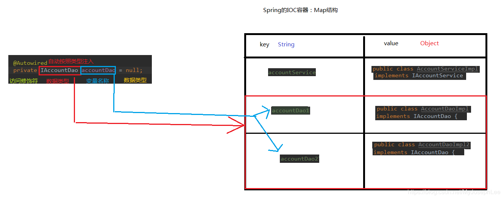

随着bean的增多，spring的配置文件肯定会越来越臃肿，因此spring引入了注解。 使用注解实现依赖注入的话，就不需要在applicationContext.xml中注册bean了，添加一个文件扫描器即可：
```xml
<!--文件扫描器,扫描指定包下的类-->
<context:component-scan base-package="com.pandahi"/>
```
##　1 用于创建对象的@Service、@Controller、@Component、@Repository

这几个注解实现的功能是一样的，都是实现依赖注入，为调用者提供对象实例。只是所在的模块有一定区分。

- @Service：一般在业务层service层。
- @Controller：一般在前后端交互的表现层controller层。
- @Repository：一般用在持久层，与数据库相关的。Dao层。
- @Component：没有特别明确的位置，但一般可以放在上三者相关不明确的类。
    作用：将当前类的对象存入spring容器中。
    属性：value：用于指定bean的id。当我们不写时，它的默认值是当前类名，且首字母改小写。

## 2 用于注入数据@Autowired、@Qualifier、@Resource、@Value
- @Autowired：自动按照类型注入。只要容器中有唯一的一个bean对象类型和要注入的变量类型匹配，就可以注入成功。
如果ioc容器中没有任何bean的类型和要注入的变量类型匹配，则报错。
如果Ioc容器中有多个类型匹配时：出现位置：可以是变量上，也可以是方法上。
细节：在使用注解注入时，set方法就不是必须的了。



- @Qualifiy
作用：在按照类中注入的基础之上再按照名称注入。它在给类成员注入时不能单独使用,需要配合@Autowired。但是在给方法参数注入时可以（稍后我们讲）
属性：value：用于指定注入bean的id。

```
@Autowired
@Qualifier("userDao")
private UserDao userDao;
```
- @Resource
作用：直接按照bean的id注入。它可以独立使用
属性：
name：用于指定bean的id。
- @Value
作用：
注入基本数据类型和 String 类型数据的
属性：
value：用于指定值
## 3 用于改变作用范围
- @Scope
作用：
指定 bean 的作用范围。
属性：
value：指定范围的值。
取值：singleton prototype request session globalsession


## 新注解：

- @Configuration
作用：
用于指定当前类是一个 spring 配置类，当创建容器时会从该类上加载注解。获取容器时需要使用
AnnotationApplicationContext(有@Configuration 注解的类.class)。
属性：
value:用于指定配置类的字节码
``` JAVA
/**
* spring 的配置类，相当于 bean.xml 文件
*/
@Configuration
public class SpringConfiguration {
}

```
注意：
我们已经把配置文件用类来代替了，但是如何配置创建容器时要扫描的包呢？
请看下一个注解

- @ComponentScan
作用：
用于指定 spring 在初始化容器时要扫描的包。作用和在 spring 的 xml 配置文件中的：
`<context:component-scan base-package="com.panda00hi"/>`是一样的。
属性：
basePackages：用于指定要扫描的包。和该注解中的 value 属性作用一样
``` JAVA

/**
* spring 的配置类，相当于 bean.xml 文件
*
*/
@Configuration
@ComponentScan("com.panda00hi")
public class SpringConfiguration {
}
```
注意：
我们已经配置好了要扫描的包，但是数据源和 JdbcTemplate 对象如何从配置文件中移除呢？
请看下一个注解。

- @Bean
作用：该注解只能写在方法上，表明使用此方法创建一个对象，并且放入 spring 容器
属性：name：给当前@Bean 注解方法创建的对象指定一个名称(即 bean 的 id)
``` JAVA
public class JdbcConfig {
    @Value("${jdbc.driver}")
    private String driver;

    @Value("${jdbc.url}")
    private String url;

    @Value("${jdbc.username}")
    private String username;

    @Value("${jdbc.password}")
    private String password;

    @Bean(name = "jdbcTemplate")
    public JdbcTemplate createJdbcTemplate(DataSource dataSource) {
        return new JdbcTemplate(dataSource);
    }

    @Bean(name = "dataSource")
    public DataSource createDataSource() {
        DriverManagerDataSource ds = new DriverManagerDataSource();
        ds.setDriverClassName(driver);
        ds.setUrl(url);
        ds.setUsername(username);
        ds.setPassword(password);
        return ds;
    }
}

```
- @PropertySource
作用：
用于加载.properties 文件中的配置。例如我们配置数据源时，可以把连接数据库的信息写到
properties 配置文件中，就可以使用此注解指定 properties 配置文件的位置。
属性：
value[]：用于指定 properties 文件位置。如果是在类路径下，需要写上 classpath:

``` JAVA
/**
* 连接数据库的配置类
*/
public class JdbcConfig {
@Value("${jdbc.driver}")
private String driver;
@Value("${jdbc.url}")
private String url;
@Value("${jdbc.username}")
private String username;
@Value("${jdbc.password}")
private String password;
/**
* 创建一个数据源，并存入 spring 容器中
* @return
*/
@Bean(name="dataSource")
public DataSource createDataSource() {
try {
ComboPooledDataSource ds = new ComboPooledDataSource();
ds.setDriverClass(driver);
ds.setJdbcUrl(url);
ds.setUser(username);
ds.setPassword(password);
return ds;
} catch (Exception e) {
throw new RuntimeException(e);
}
}
}
jdbc.properties 文件：
jdbc.driver=com.mysql.jdbc.Driver
jdbc.url=jdbc:mysql://localhost:3306/day44_ee247_spring

jdbc.username=root
jdbc.password=1234
```
注意：
此时我们已经有了两个配置类，但是他们还没有关系。如何建立他们的关系呢？
请看下一个注解。 

- @Import
作用：
用于导入其他配置类，在引入其他配置类时，可以不用再写@Configuration 注解。当然，写上也没问
题。
属性：
value[]：用于指定其他配置类的字节码。

``` JAVA
@Configuration
@ComponentScan(basePackages = "com.panda00hi.spring")
@Import({ JdbcConfig.class})
public class SpringConfiguration {
}
@Configuration
@PropertySource("classpath:jdbc.properties")
public class JdbcConfig{
}
```
注意：
我们已经把要配置的都配置好了，但是新的问题产生了，由于没有配置文件了，如何获取容器呢？
请看下一小节。

## 通过注解获取容器
ApplicationContext ac = 
new AnnotationConfigApplicationContext(SpringConfiguration.class);