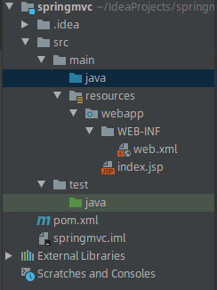
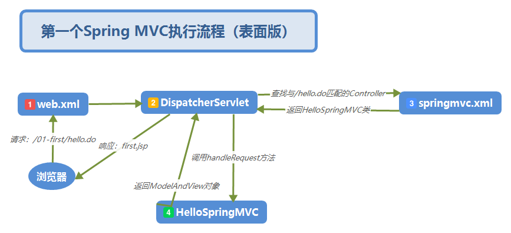
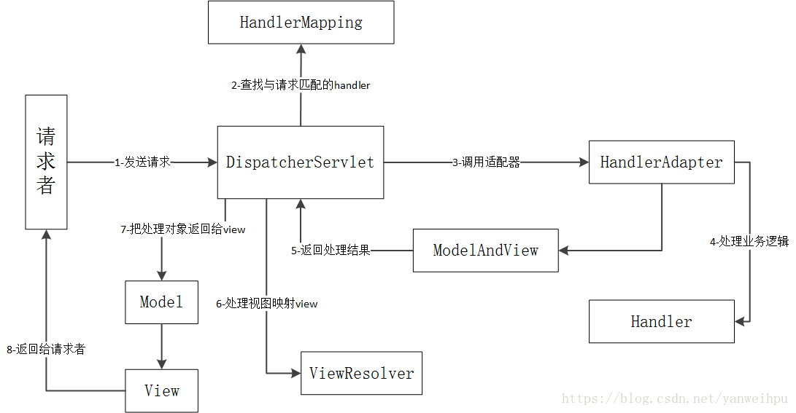

## 1 简介
springmvc是用于表现层的框架，也被称为spring web mvc。
在使用springmvc之类的框架之前，javaWEB中是使用servlet，但是过程比较复杂，要写大量的判断逻辑处理相应的增删改查。所以，通过框架，将过程进行抽象封装，简化了开发流程。

SpringMVC框架是以请求为驱动，围绕Servlet设计，将请求发给控制器，然后通过模型对象，分派器来展示请求结果视图。其中核心类是DispatcherServlet，它是一个Servlet，顶层是实现的Servlet接口。

### 主要组件

* 前端控制器（DispatcherServlet）: 接收请求，响应结果，返回可以是json, String等数据类型，也可以是页面（Model）。
* 处理器映射器（HandlerMapping）: 根据URL去查找处理器，一般通过xml配置或者注解进行查找。
* 处理器（Handler）：就是我们常说的controller控制器啦，由程序员编写。
* 处理器适配器（HandlerAdapter）: 可以将处理器包装成适配器，这样就可以支持多种类型的处理器。
* 视图解析器（ViewResovler）: 进行视图解析，返回view对象（常见的有JSP, FreeMark等）。

## 2 实例代码分析

### 2.1 项目创建步骤

#### 2.1.1 创建maven工程，选择Apache.maven... webapp。

(也可以自己添加相应的jar包和目录)

自动生成目录结构为。



#### 2.1.2 导入依赖

``` xml
<dependency>
    <groupId>org.springframework</groupId>
    <artifactId>spring-webmvc</artifactId>
    <version>5.2.0.RELEASE</version>
</dependency>
<dependency>
    <groupId>javax.servlet</groupId>
    <artifactId>javax.servlet-api</artifactId>
    <version>3.1.0</version>
</dependency>
```

#### 2.1.3 在web.xml中注册springmvc的中央控制器DispatcherServlet。

``` xml
<?xml version="1.0" encoding="UTF-8"?>
<web-app xmlns="http://xmlns.jcp.org/xml/ns/javaee"
         xmlns:xsi="http://www.w3.org/2001/XMLSchema-instance"
         xsi:schemaLocation="http://xmlns.jcp.org/xml/ns/javaee http://xmlns.jcp.org/xml/ns/javaee/web-app_3_1.xsd"
         version="3.1">
    <!--注册springMVC的前端控制器-->
    <servlet>
        <servlet-name>springmvc</servlet-name>
        <!--是spring-webmvc包提供的包，即用于控制所有请求-->
        <servlet-class>org.springframework.web.servlet.DispatcherServlet</servlet-class>
        <!--如果我们不去修改spring配置文件默认的位置，那么springmvc
        它会去web-inf下面找一个叫做springmvc-servlet.xml的文件
        -->
        <init-param>
            <param-name>contextConfigLocation</param-name>
            <param-value>classpath:springmvc.xml</param-value>
        </init-param>
        <!--启动优先级-->
        <load-on-startup>1</load-on-startup>
    </servlet>

    <servlet-mapping>
        <servlet-name>springmvc</servlet-name>
        <url-pattern>/</url-pattern>
    </servlet-mapping>

</web-app>
```

#### 2.1.4 创建springmvc.xml配置文件

maven项目中有个src/main/resources目录，在该目录下创建Spring MVC配置文件springmvc.xml，该xml配置文件可以任意命名，需要跟第三步中的init-param中的param-value保持一致即可。

#### 2.1.4 创建Controller，并在springmvc.xml中配置

``` xml
<?xml version="1.0" encoding="UTF-8"?>
<beans xmlns="http://www.springframework.org/schema/beans"
       xmlns:xsi="http://www.w3.org/2001/XMLSchema-instance"
       xsi:schemaLocation="http://www.springframework.org/schema/beans http://www.springframework.org/schema/beans/spring-beans.xsd">
    
    <!--配置controller-->
    <bean id="/hello.do" class="com.panda00hi.controller.HelloController"/>

</beans>
```

Controller类

``` JAVA
package com.panda00hi.controller;

import org.springframework.web.servlet.ModelAndView;
import org.springframework.web.servlet.mvc.Controller;

import javax.servlet.http.HttpServletRequest;
import javax.servlet.http.HttpServletResponse;

public class HelloController implements Controller {
    @Override
    public ModelAndView handleRequest(HttpServletRequest request, HttpServletResponse response) throws Exception {
        ModelAndView mv = new ModelAndView();

        // 向ModelAndView这个对象中添加一条数据，名字是flag，内容是hello first spring mvc
        // 在ModelAndView对象里面添加的数据，可以从jsp中获取，这里是直接使用EL表达式获取的数据。
        mv.addObject("flag", "hello first spring mvc");
        
        // 括号中的内容是要跳转的jsp的路径和文件名。
        mv.setViewName("/WEB-INF/jsp/first.jsp");
        return mv;
    }
}

```

#### 2.1.5 启动tomcat，浏览器访问即可

默认打开的是根目录下的index.jsp主页
http://localhost:8080/demo01

跳转到指定的first.jsp页面
http://localhost:8080/demo01/hello.do

**注意：**
idea中出现404，有可能是Tomcat配置问题


注意部署前，检查一下，这里可以自定义设置，但是要主要是否生效或者冲突之类的。

### 2.2 配置试图解析器

在controller中我们在ModelAndView中的setViewName方法里面传入要跳转的jsp的路径和名字，如果有多个controller的话，需要在每个里面都编写路径和jsp的名字，这样的话比较繁琐，这时可以通过使用Spring MVC给我们提供的一个视图解析器来解决这个问题。 打开springmvc.xml的配置文件，在里面添加一个视图解析器：

``` xml
<?xml version="1.0" encoding="UTF-8"?>
<beans xmlns="http://www.springframework.org/schema/beans"
       xmlns:xsi="http://www.w3.org/2001/XMLSchema-instance" xmlns:mvc="http://www.springframework.org/schema/mvc"
       xsi:schemaLocation="http://www.springframework.org/schema/beans http://www.springframework.org/schema/beans/spring-beans.xsd http://www.springframework.org/schema/mvc http://www.springframework.org/schema/mvc/spring-mvc.xsd">

    <!-- 视图解释类 -->
    <bean class="org.springframework.web.servlet.view.InternalResourceViewResolver">
        <property name="prefix" value="/WEB-INF/jsp/"/>
        <property name="suffix" value=".jsp"/>
    </bean>

    <mvc:resources mapping="/imags/**" location="/imags/"/>
    <!--配置controller-->
    <bean id="/hello.do" class="com.panda00hi.controller.HelloController"/>

</beans>
```

其中prefix表示前缀，即你的jsp所在的路径。 suffix表示后缀，即文件的后缀名。 之后来修改一下Controller中的内容，改为
`mv.setViewName("first");` 
这样以后就不用再setViewName方法中写路径了，并且也方便日后的维护。

## 3 流程分析



1、客户端（浏览器）发型请求 http://localhost:8080/demo01/hello.do，到达web服务器（tomcat）后，会在web.xml文件中查找与之匹配的servlet，我们在web.xml文件中设置的所有请求都会匹配到Spring MVC的核心控制器DispatcherServlet上。

2、DispatcherServlet会根据springmvc.xml配置文件中查找与hello.do请求匹配的Controller，这里配置的是

``` 
```
<!--配置controller-->
    <bean id="/hello.do" class="com.panda00hi.controller.HelloController"/>
```

3、DispatcherServlet会将请求转到HelloController类上，并调用该类中的handleRequest方法来处理这个请求。

4、在handleRequest方法中执行完成后会将ModelAndView对象返回给DispatcherServlet，然后ispatcherServlet将jsp响应给浏览器，流程结束。

多种表述：



流程说明：

（1）客户端（浏览器）发送请求，直接请求到DispatcherServlet。

（2）DispatcherServlet根据请求信息调用HandlerMapping，解析请求对应的Handler。

（3）解析到对应的Handler后，开始由HandlerAdapter适配器处理。

（4）HandlerAdapter会根据Handler来调用真正的处理器开处理请求，并处理相应的业务逻辑。

（5）处理器处理完业务后，会返回一个ModelAndView对象，Model是返回的数据对象，View是个逻辑上的View。

（6）ViewResolver会根据逻辑View查找实际的View。

（7）DispaterServlet把返回的Model传给View。

（8）通过View返回给请求者（浏览器）

第一步:

浏览器发送请求到前端控制器（在web.xml中配置了的前端控制器）

第二步

前端控制器接收到了发送过来的请求，并在发送给处理器映射器，查看一下是否由能够匹配的映射（也就是注解上面的映射）

第三步

处理器映射器处理完成之后返回结果个前端控制器，前端控制器再拿着查询的结果去找处理器适配器，让处理器适配器适配到正确的（也就是和映射匹配的）处理器处理请求

第四步

处理器适配器找到正真的处理器把请求交给他来真正的处理（也就是自己写的那个控制器的类）

第五步

处理器处理完成之后返回一个模型和视图给处理器适配器，这其中就包含了已经处理完成的数据

第六步

处理器适配器接收到处理器处理完成的数据后再次返回到前端控制器

第七步

前端控制器把结果和数据交给到视图解析器，把数据写到视图中并返回一个视图对象给前端控制器

第八步

前端控制器接收到视图对象后交给jsp渲染成界面并再次返还

第九步

前端控制器接收到返还的已经渲染好的视图后响应给浏览器展现给用户

