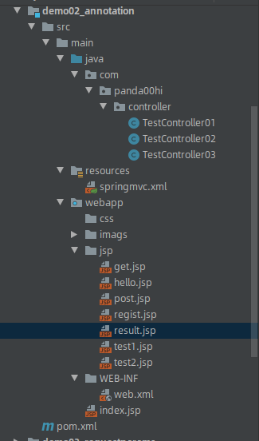
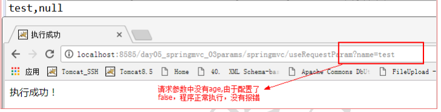
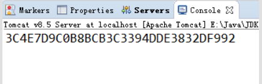
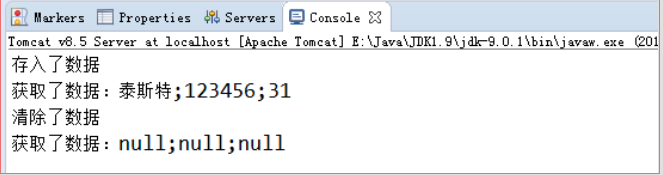

需要在配置文件中注册一个组件扫描器，开启注解，作用是扫描指定包下的所有包和类。

@Controller之后，就标记它是spring的一个组件-控制器组件，此时handlermapping会去扫描，寻找这个controller是否与之匹配，如果发现匹配就把这里处理的工作交给它。

匹配规则就是通过路径@RequestMapping(URI)进行匹配。（该注解可在类上或方法上）

## 1 实例代码

### 目录结构



### 1.1 配置web.xml

``` xml
<?xml version="1.0" encoding="UTF-8"?>
<beans xmlns="http://www.springframework.org/schema/beans"
       xmlns:xsi="http://www.w3.org/2001/XMLSchema-instance" xmlns:mvc="http://www.springframework.org/schema/mvc"
       xmlns:context="http://www.springframework.org/schema/context"
       xsi:schemaLocation="http://www.springframework.org/schema/beans http://www.springframework.org/schema/beans/spring-beans.xsd http://www.springframework.org/schema/mvc http://www.springframework.org/schema/mvc/spring-mvc.xsd http://www.springframework.org/schema/context http://www.springframework.org/schema/context/spring-context.xsd">

    <!--注解驱动：如果配置了静态资源和组件扫描器，需要该标签-->
    <mvc:annotation-driven/>

    <!--注册组件扫描器-->
    <context:component-scan base-package="com.panda00hi.*"/>

    <!--静态资源-->
    <mvc:resources mapping="/imags/**" location="/imags/"/>
    <mvc:resources mapping="/css/**" location="/css/"/>
    <!--视图解析器-->
    <bean class="org.springframework.web.servlet.view.InternalResourceViewResolver">
        <property name="prefix" value="/jsp/"></property>
        <property name="suffix" value=".jsp"></property>
    </bean>

    <!--配置controller-->
    <!--<bean id="/test.do" class="com.panda00hi.controller.TestController"/>-->

</beans>
```

### 1.2 配置springmvc.xml，开启扫描、注解驱动等。

``` xml
<?xml version="1.0" encoding="UTF-8"?>
<beans xmlns="http://www.springframework.org/schema/beans"
       xmlns:xsi="http://www.w3.org/2001/XMLSchema-instance" xmlns:mvc="http://www.springframework.org/schema/mvc"
       xmlns:context="http://www.springframework.org/schema/context"
       xsi:schemaLocation="http://www.springframework.org/schema/beans http://www.springframework.org/schema/beans/spring-beans.xsd http://www.springframework.org/schema/mvc http://www.springframework.org/schema/mvc/spring-mvc.xsd http://www.springframework.org/schema/context http://www.springframework.org/schema/context/spring-context.xsd">

    <!--注解驱动：如果配置了静态资源和组件扫描器，需要该标签-->
    <mvc:annotation-driven/>

    <!--注册组件扫描器-->
    <context:component-scan base-package="com.panda00hi.*"/>

    <!--静态资源-->
    <mvc:resources mapping="/imags/**" location="/imags/"/>
    <mvc:resources mapping="/css/**" location="/css/"/>
    <!--视图解析器-->
    <bean class="org.springframework.web.servlet.view.InternalResourceViewResolver">
        <property name="prefix" value="/jsp/"></property>
        <property name="suffix" value=".jsp"></property>
    </bean>

    <!--配置controller-->
    <!--<bean id="/test.do" class="com.panda00hi.controller.TestController"/>-->

</beans>
```

### 1.3 相关的网页文件jsp

#### 1.3.1 result.jsp

``` jsp

<%@ page contentType="text/html;charset=UTF-8" language="java" %>
<html>
<head>
    <title>结果</title>
</head>
<body>
姓名：${username}
<br>
年龄：${age}

</body>
</html>
```

#### 1.3.2 test2.jsp

``` jsp
<%--
  Created by IntelliJ IDEA.
  User: panda
  Date: 2019/4/3
  Time: 11:58
  To change this template use File | Settings | File Templates.
--%>
<%@ page contentType="text/html;charset=UTF-8" language="java" %>
<html>
<head>
    <title>test2</title>
</head>
<body>
<h1>这里是test2.jsp</h1>
${flag}
</body>
</html>

```

### 1.4 创建控制器Controller

#### 1.4.1 带参数的result.jsp

``` JAVA
package com.panda00hi.controller;

import org.springframework.stereotype.Controller;
import org.springframework.web.bind.annotation.PathVariable;
import org.springframework.web.bind.annotation.RequestMapping;
import org.springframework.web.servlet.ModelAndView;

@Controller
public class TestController01 {
    //如果requestMapping中的变量名跟方法参数名一致，那么只需要@PathVariable注解即可
    //不一致，则需要在注解中指定
    @RequestMapping("/{username}/{age}/userInfo")
    public ModelAndView userInfo(@PathVariable("username") String name,@PathVariable int age) throws Exception {
        ModelAndView mv = new ModelAndView();

        mv.addObject("username", name);
        mv.addObject("age", age);

        mv.setViewName("result");
        return mv;
    }
}

```

#### 1.4.2 @RequestMapping("/test")命名空间

``` JAVA

package com.panda00hi.controller;

import org.springframework.stereotype.Controller;
import org.springframework.web.bind.annotation.RequestMapping;
import org.springframework.web.servlet.ModelAndView;

import javax.servlet.http.HttpServletRequest;
import javax.servlet.http.HttpServletResponse;

//使用注解，则不需要再用implements
@Controller    //表明当前类是一个controller
@RequestMapping("/test")    //表示requestMapping的命名空间
public class TestController02 {

    @RequestMapping("/test2.do")
    public ModelAndView test1(HttpServletRequest request, HttpServletResponse response) throws Exception {
        ModelAndView mv = new ModelAndView();
        mv.addObject("flag", "Hello,TestController02.test1()");
        //指定跳转路径
        mv.setViewName("/test2");
        return mv;
    }

    @RequestMapping({"/hello.do", "/world.do"})
    public ModelAndView test2(HttpServletRequest request, HttpServletResponse response) throws Exception {
        ModelAndView mv = new ModelAndView();
        mv.addObject("flag", "Hello,TestController02.test2()");
        //指定跳转路径
        mv.setViewName("test2");
        return mv;
    }
}

```

### 1.5 浏览器带参数访问，验证

http://localhost:8080/demo02/lisi/15/userInfo

可看到result.jsp已经拿到相应的传值。

http://localhost:8080/demo02/test/test2.do

可以看到访问到了test2.jsp

## 2 @RequestMapping的常用属性

### 2.1 通配符

在RequestMapping中我们可以使用*号表示通配符从而匹配一系列的请求：

``` 
@RequestMapping("/test*.do")
```

表示请求的url中只要是以test开头就可以被当前方法处理。

``` 
@RequestMapping("/*test.do")
```

表示请求的url中只要是以test结尾就可以被当前方法处理。

``` 
@RequestMapping("panda00hi/*/test.do")
```

表示在test.do的前面，只能有两级路径，第一级必须是panda00hi，而第二级随意，例如：panda00hi/any/test.do。这种称为路径级数的精确匹配。

``` 
@RequestMapping("panda00hi/**/test.do")
```

表示在test.do的资源名称前面，必须以panda00hi路径开头，而其它级的路径包含几级，各级又叫什么名称，均随意，例如：panda00hi/1/0/2/4/test.do。 这种称为路径级数的可变匹配。

### 2.2 限定请求的提交方式

在@RequestMapping中有一个method属性，改属性可以设置接收请求的提交方式：

``` JAVA
package com.panda00hi.controller;

import org.springframework.stereotype.Controller;
import org.springframework.web.bind.annotation.RequestMapping;
import org.springframework.web.bind.annotation.RequestMethod;
import org.springframework.web.servlet.ModelAndView;

import javax.servlet.http.HttpServletRequest;
import javax.servlet.http.HttpServletResponse;

@Controller
@RequestMapping("/test")
public class TestController03 {

//    @RequestMapping("/test.do")
    //限定请求提交方式
    @RequestMapping(value = "/requestPost.do", method = RequestMethod.POST)
    //限定请求提交的参数
//    @RequestMapping(value = "/requestPost.do", params = {"name","age"})
    public ModelAndView rePost(HttpServletRequest request, HttpServletResponse response) throws Exception {
        ModelAndView mv = new ModelAndView();
        mv.addObject("method", "只支持post请求");
        //指定跳转路径
        mv.setViewName("post");
        return mv;
    }

    @RequestMapping(value = "/requestGet.do", method = RequestMethod.GET)
    public ModelAndView reGet(HttpServletRequest request, HttpServletResponse response) throws Exception {
        ModelAndView mv = new ModelAndView();
        mv.addObject("method", "只支持Get请求");
        //指定跳转路径
        mv.setViewName("get");
        return mv;
    }
}

```

上面的注解表示，只有当/test.do的请求的方式是post的时候才会执行当前方法，对于其他请求方式不进行处理。如果不写method属性的话，无论你是使用get或者post或者其他方式，它都会进行处理。
上面的RequestMethod是一个枚举类型，里面包含了大部分的提交方式。

webapp根目录下的index.jsp

``` 
<%@ page contentType="text/html;charset=UTF-8" language="java" %>

<html>
<body>
<h2>Hello World!</h2>
<!--默认请求方法是get，已验证-->
<form action="/test/requestPost.do" method="post">

    <input type="text" value="name">
    <input type="text" value="age">
    <input type="submit" value="Post请求">
</form>
<br>
<form action="/test/requestGet.do" method="get">
    <input type="submit" value="Get请求">
</form>


</body>
</html>

```

### 2.3 请求中携带的参数

在RequestMapping中还有一个属性是params，通过这个属性我们可以指定请求中必须携带的参数。

要求请求中必须携带请求参数 name 与 age

``` 
@RequestMapping(value="/test.do" ,  params={"name" , "age"}) 
```

要求请求中必须携带请求参数 age，但必须不能携带参数 name

``` 
@RequestMapping(value="/test.do" , params={"!name" , "age"}) 
```

要求请求中必须携带请求参数 name，且其值必须为jack；必须携带参数 age，其值必须为 23

``` 
@RequestMapping(value="/test.do" , params={"name=jack" , "age=23"}) 
```

要求请求中必须携带请求参数name，且其值必须不能为jack

``` 
@RequestMapping(value="/test.do" , params="name!=jack") 
```

## 3 常用注解

### 3.1 @RequestParam

**作用：**
把请求中指定名称的参数给控制器中的形参赋值。
**属性：**
value：请求参数中的名称。
required：请求参数中是否必须提供此参数。默认值：true。表示必须提供，如果不提供将报错
defaultValue：指定当前参数的默认值。如果请求中没有该参数，则当前方法参数将取该默认值。
**示例：**
jsp 中的代码：

``` jsp
<!-- requestParams 注解的使用 -->
<a href="springmvc/useRequestParam?name=test">requestParam 注解</a>
```

控制器中的代码：

``` java
/**

* requestParams 注解的使用
* @param username
* @return

*/
@RequestMapping("/useRequestParam")
public String useRequestParam(@RequestParam("name")String username,
@RequestParam(value="age",required=false)Integer age){
System.out.println(username+","+age);
return "success";
}
```

**运行结果**



### 3.2 @RequestBody

**作用：**
用于获取请求体内容。直接使用得到是 key=value&key=value... 结构的数据。
get 请求方式不适用。
**属性：**
required：是否必须有请求体。默认值是:true。当取值为 true 时, get 请求方式会报错。如果取值
为 false，get 请求得到是 null。

post 请求 jsp 代码：

``` jsp
<!-- request body 注解 -->
<form action="springmvc/useRequestBody" method="post">
用户名称：<input type="text" name="username" ><br/>
用户密码：<input type="password" name="password" ><br/>
用户年龄：<input type="text" name="age" ><br/>
<input type="submit" value="保存">
</form>
```

get 请求 jsp 代码：

``` jsp
<a href="springmvc/useRequestBody?body=test">requestBody 注解 get 请求</a>
```

控制器代码

``` JAVA
/**

* RequestBody 注解
* @param user
* @return

*/
@RequestMapping("/useRequestBody")
public String useRequestBody(@RequestBody(required=false) String body){
System.out.println(body);
return "success";
}
```

post请求运行结果：
username=lisi&password=123&age=10

get请求运行结果：
null

### 3.3 @PathVaribale

**作用：**
用于绑定 url 中的占位符。
例如：请求 url 中 /delete/{id}，这个{id}就是 url 占位符。
url 支持占位符是 spring3.0 之后加入的。是 springmvc 支持 rest 风格 URL 的一个重要标志。
**属性：**
value：用于指定 url 中占位符名称。当url中的名称和方法参数名称不一致时，可以使用该属性解决。
required：是否必须提供占位符. 若为 true，则表示请求中所携带的参数中必须包含当前参数。若为 false，则表示有没有均可。

jsp 代码：

``` jsp
<!-- PathVariable 注解 -->
<a href="springmvc/usePathVariable/100">pathVariable 注解</a>
```

控制器代码：

``` java
/**

* PathVariable 注解
* @param user
* @return

*/
@RequestMapping("/usePathVariable/{id}")
public String usePathVariable(@PathVariable("id") Integer id){
System.out.println(id);
return "success";
}
```

运行，可获得url中的id值100

### 3.4 @RequestHeader

**作用：**
用于获取请求消息头。
**属性：**
value：提供消息头名称
required：是否必须有此消息头

>> 注：在实际开发中一般不怎么用

### 3.5 @CookieValue

**作用：**
用于把指定 cookie 名称的值传入控制器方法参数。
**属性：**
value：指定 cookie 的名称。
required：是否必须有此 cookie。

jsp 中的代码：

``` jsp
<!-- CookieValue 注解 -->
<a href="springmvc/useCookieValue">绑定 cookie 的值</a>
```

控制器中的代码：

``` JAVA
/**

* Cookie 注解注解
* @param user
* @return

*/
@RequestMapping("/useCookieValue")
public String useCookieValue(@CookieValue(value="JSESSIONID",required=false) 
String cookieValue){
System.out.println(cookieValue);
return "success";
}

```

运行结果



### 3.5 @ModelAttribute

参考 https://www.cnblogs.com/canger/p/10241576.html

在一个Controller内，被@ModelAttribute标注的方法会在此controller的每个handler方法执行前被执行。

被@ModelAttribute标注的方法的参数绑定规则和普通handler方法相同。
可以理解为：

请求到达Controller后，不论其他handler方法的RequestMapping值是多少，请求都会路由至被@ModelAttribute标注的方法；
由springMVC再对request执行一次forward，路由至真正的handler方法。

**作用：**
该注解是 SpringMVC4.3 版本以后新加入的。它可以用于修饰方法和参数。
出现在方法上，表示当前方法会在控制器的方法执行之前，先执行。它可以修饰没有返回值的方法，也可
以修饰有具体返回值的方法。
出现在参数上，获取指定的数据给参数赋值。

**属性：**
value：用于获取数据的 key。key 可以是 POJO 的属性名称，也可以是 map 结构的 key。

**应用场景：**
当表单提交数据不是完整的实体类数据时，保证没有提交数据的字段使用数据库对象原来的数据。
例如：
我们在编辑一个用户时，用户有一个创建信息字段，该字段的值是不允许被修改的。在提交表单数据是肯定没有此字段的内容，一旦更新会把该字段内容置为 null，此时就可以使用此注解解决问题。

### 3.6 @SessionAttribute

**作用：**
用于多次执行控制器方法间的参数共享。
**属性：**
value：用于指定存入的属性名称
type：用于指定存入的数据类型。

jsp 中的代码：

``` jsp
<!-- SessionAttribute 注解的使用 -->
<a href="springmvc/testPut">存入 SessionAttribute</a>
<hr/>
<a href="springmvc/testGet">取出 SessionAttribute</a>
<hr/>
<a href="springmvc/testClean">清除 SessionAttribute</a>
```

控制器中的代码：

``` java
/**

* SessionAttribute 注解的使用

*/
@Controller("sessionAttributeController")
@RequestMapping("/springmvc")
@SessionAttributes(value ={"username","password"},types={Integer.class}) 
public class SessionAttributeController {
/**

* 把数据存入 SessionAttribute
* @param model
* @return
* Model 是 spring 提供的一个接口，该接口有一个实现类 ExtendedModelMap
* 该类继承了 ModelMap，而 ModelMap 就是 LinkedHashMap 子类

*/
@RequestMapping("/testPut") 
public String testPut(Model model){ 
 model.addAttribute("username", "泰斯特"); 
 model.addAttribute("password","123456"); 
 model.addAttribute("age", 31); 
 //跳转之前将数据保存到 username、password 和 age 中，因为注解@SessionAttribute 中有
这几个参数 
 return "success"; 
 } 
 
 @RequestMapping("/testGet") 
 public String testGet(ModelMap model){ 
 
System.out.println(model.get("username")+";"+model.get("password")+";"+model.get("a
ge")); 
 return "success"; 
 } 
 
 @RequestMapping("/testClean") 
 public String complete(SessionStatus sessionStatus){ 
 sessionStatus.setComplete(); 
 return "success"; 
 } 
}

```

运行结果



