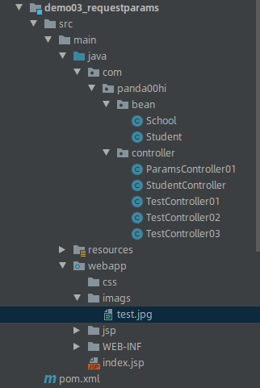

### 目录结构



index.jsp做一个连接，方便交互
```
<%@ page contentType="text/html;charset=UTF-8" language="java" %>

<html>
<body>
<h2>首页</h2>
<form action="/jsp/regist.jsp" >

    <input type="button" value="跳转到注册页面">
</form>


</body>
</html>
```


### 1 带有表单的registe.jsp和结果result.jsp
```jsp
<%--
  Created by IntelliJ IDEA.
  User: panda
  Date: 2019/4/3
  Time: 16:09
  To change this template use File | Settings | File Templates.
--%>
<%@ page contentType="text/html;charset=UTF-8" language="java" %>
<html>
<head>
    <title>注册</title>
</head>
<body>
<form action="/user/params01.do" method="post">

    姓名：<input type="text" name="username">
    <br>
    年龄：<input type="text" name="age">
    <br>
    <input type="submit" value="提交">
</form>

</body>
</html>

```
```
<%--
  Created by IntelliJ IDEA.
  User: panda
  Date: 2019/4/3
  Time: 16:18
  To change this template use File | Settings | File Templates.
--%>
<%@ page contentType="text/html;charset=UTF-8" language="java" %>
<html>
<head>
    <title>结果</title>
</head>
<body>
姓名：${username}
<br>
年龄：${age}

</body>
</html>

```

## 2 创建Controller
``` JAVA
package com.panda00hi.controller;

import org.springframework.stereotype.Controller;
import org.springframework.web.bind.annotation.RequestMapping;
import org.springframework.web.servlet.ModelAndView;

@Controller
@RequestMapping("/user")
public class ParamsController01 {

    @RequestMapping("/params01")
    public ModelAndView getParams01(String username, int age) throws Exception {

        ModelAndView mv = new ModelAndView();
        mv.addObject("username", username);
        mv.addObject("age", age);
        mv.setViewName("result");
    return mv;
    }

}

```
在controller中参数列表写上了两个参数username和age，因为这两个参数与表单中input中的name一致，所以spring MVC会自动为其赋值，通过这种方式就可以在controller中获取表单提交的数据值。

在之前写的controller中的方法参数列表里面都写上了request和response，而这里却没有写，其实这不会影响springmvc的工作，也就是说在controller的方法里面，我们可以写多个参数，也可以一个都不写，不过spring mvc只会自动为以下五个参数进行自动赋值：

HttpServletRequest
HttpServletResponse
HttpSession
请求携带的参数
用于承载数据的Model

当前示例其实就是spring mvc将请求携带参数进行赋值，这样子就可以直接获取表单提交的数据了。

