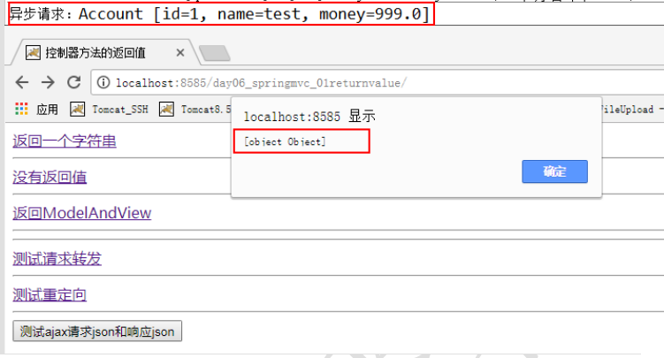

## 响应数据和结果视图

## 1 Controller中方法的返回值类型

在我们之前写的Controller的方法中，返回值都写的是ModelAndView，其实还可以返回其他类型的对象，在实际应用中需要根据不同的情况来使用不同的返回值：

* ModelAndView
* String
* void
* 自定义类型

### 1.1 返回ModelAndView类型

先来看下ModelAndView，这个是我们之前一直使用的返回值，如果Controller的方法执行完毕后，需要跳转到jsp或其他资源，且又要传递数据， 此时方法返回ModelAndView比较方便。
如果只传递数据，或者只跳转jsp或其他资源的话，使用ModelAndView就显得有些多余了。

### 1.2 返回String类型

如果controller中的方法在执行完毕后，需要跳转到jsp或者其他资源上，此时就可以让该方法返回String类型。

#### 1.2.1 返回内部资源

创建一个Controller，方法返回String类型：

``` java
package com.panda00hi.controller;

import org.springframework.stereotype.Controller;
import org.springframework.web.bind.annotation.RequestMapping;

/**
 * 方法中返回String
 * 如果只希望方法执行完，跳转jsp或其他资源，则可以使用String返回值
 */
@Controller
public class ReturnStringController {
    /**
     * 跳转到内部资源
     * @return
     * @throws Exception
     */
    @RequestMapping("/welcome")
    public String welcome() throws Exception {
        return "welcome";
    }
}

```

**新建welcom.jsp**

``` html
<%--
  Created by IntelliJ IDEA.
  User: panda
  Date: 2019/4/4
  Time: 13:45
  To change this template use File | Settings | File Templates.
--%>
<%@ page contentType="text/html;charset=UTF-8" language="java" %>
<html>

<head>
    <title>欢迎</title>
</head>

<body>
    <h1>welcome，let me show you how it works！！</h1>

</body>

</html>
```

**在浏览器的地址栏中输入：**

``` 
localhost:8080/welcome.do
```

即可访问到welcome.jsp。

#### 1.2.2 返回外部资源，如www.baidu.com

首先在springmvc.xml文件中配置一个新的视图解析器——BeanNameViewResolver类，然后定义外部资源view对象。springmvc.xml如下

``` xml
<?xml version="1.0" encoding="UTF-8"?>
<beans xmlns="http://www.springframework.org/schema/beans"
       xmlns:xsi="http://www.w3.org/2001/XMLSchema-instance"
       xmlns:context="http://www.springframework.org/schema/context"
       xmlns:mvc="http://www.springframework.org/schema/mvc"
       xsi:schemaLocation="http://www.springframework.org/schema/beans http://www.springframework.org/schema/beans/spring-beans.xsd http://www.springframework.org/schema/context http://www.springframework.org/schema/context/spring-context.xsd http://www.springframework.org/schema/mvc http://www.springframework.org/schema/mvc/spring-mvc.xsd">

    <!--注解驱动-->
    <mvc:annotation-driven/>
    <!--静态资源-->
    <mvc:resources mapping="/imags/**" location="/imags/"/>
    <mvc:resources mapping="/css/**" location="/css/"/>

    <!--组件扫描器-->
    <context:component-scan base-package="com.panda00hi.*"/>
    

    <!--请求仍然会跳转到内部jsp，需要新配置一个-->
    <!--外部视图解析器，放在内部解析器的之前-->
    <bean class="org.springframework.web.servlet.view.BeanNameViewResolver"/>

    <!--定义外部资源view对象，重定向-->
    <bean id="baidu" class="org.springframework.web.servlet.view.RedirectView">
        <!--注意这里的value值要把https://协议部分加上，否则访问的是localhost:8080/www.baidu.com-->
        <property name="url" value="https://www.baidu.com/"/>
    </bean>

    <!--内部视图解析器-->
    <bean class="org.springframework.web.servlet.view.InternalResourceViewResolver">
        <property name="prefix" value="/jsp/"/>
        <property name="suffix" value=".jsp"/>
    </bean>
</beans>
```

id是controller中的方法返回值，value是要跳转的外部资源的地址。  
==**注意：1、BeanNameViewResolver视图解析器要写在其他试图解析器之前。2、定义外部资源view对象的value时，要加上url的协议部分，http://**==

在controller中，创建方法

``` java
package com.panda00hi.controller;

import org.springframework.stereotype.Controller;
import org.springframework.web.bind.annotation.RequestMapping;

/**
 * 方法中返回String
 * 如果只希望方法执行完，跳转jsp或其他资源，则可以使用String返回值
 */
@Controller
public class ReturnStringController {

    /**
     * 跳转到内部资源
     * @return
     * @throws Exception
     */
    @RequestMapping("/welcome")
    public String welcome() throws Exception {

        return "welcome";
    }

    /**
     * 跳转到外部资源
     * @return
     * @throws Exception
     */
    @RequestMapping("/baidu.do")
    public String baidu() throws Exception {

        //此处返回的字符串，需要跟springmvc.xml中的外部资源view对象的bean的id保持一致
        return "baidu";
    }
}

```

在浏览器输入：

``` 
localhost:8080/baidu.do
```

会跳转到百度首页。

#### 1.2.3 Model对象

这个Model，它是一个接口，写在controller的方法中的时候，spring mvc会为其进行赋值。我们可以使用Model对象来传递数据，也就是说我们可以使用Model传递数据并且将方法返回值设置为String类型，通过这种方式实现与方法返回ModelAndView一样的功能，传递数据和跳转页面。

创建controller类

``` java
package com.panda00hi.controller;

import org.springframework.stereotype.Controller;
import org.springframework.ui.Model;
import org.springframework.web.bind.annotation.RequestMapping;

@Controller
public class ModelController {

    @RequestMapping("/modeldata.do")
    public String modelData(Model model,String name) throws Exception{
        model.addAttribute("username", name);

        model.addAttribute(name);//相当于model.addAttribute("string", name);
        return "welcome";
    }
}

```

在welcome.jsp中添加下面内容，获取model中的值：

获取model中的username值:

``` 
<br>
${username}
<br>
${string}
```

浏览器中输入(注意记得提交name参数)：

``` 
http://localhost:8080/modeldata.do?name=tom
```

### 1.3 返回void

如果你不用spring mvc帮你完成资源的跳转，此时可以将controller中的方法返回值设置为void。一般情况下有下面两个应用场景：

* 通过原始的servlet来实现跳转
* ajax响应

#### 1.3.1 使用servlet来实现跳转

spring mvc底层就是servlet，因此我们可以在controller中使用servlet中的方法来实现页面的跳转，参数的传递。

**在bean包下创建一个Student类**

``` java
package com.panda00hi.bean;

public class Student {
    private String name;
    private int age;

    public String getName() {
        return name;
    }

    public void setName(String name) {
        this.name = name;
    }

    public int getAge() {
        return age;
    }

    public void setAge(int age) {
        this.age = age;
    }
}

```

**创建controller**

``` java
package com.panda00hi.controller;

import com.panda00hi.bean.Student;
import org.springframework.stereotype.Controller;
import org.springframework.web.bind.annotation.RequestMapping;

import javax.servlet.http.HttpServletRequest;
import javax.servlet.http.HttpServletResponse;

/**
 * 方法没有返回值
 */
@Controller
public class ReturnVoidController {

    @RequestMapping("/servletjump.do")
    public void servletJump(HttpServletRequest request, HttpServletResponse response, Student student) throws Exception{

        request.setAttribute("student", student);
        request.getRequestDispatcher("/jsp/welcome.jsp").forward(request,response);
    }
}

```

welcome.jsp中获取相应中的值

``` js
$ {
    student.name
} < br >
    $ {
        student.age
    }
```

在浏览器访问  
http://localhost:8080/servletjump.do?name=tom&age=18  
在跳转后的页面可获得值。

#### 1.3.2 利用Ajax响应

##### Ajax的下载和配置
http://jquery.com/download/  
拷贝到项目中webapp/js目录中，然后编写ajaxRequest.jsp  

``` html
<%@ page contentType="text/html;charset=UTF-8" language="java" %>
<html>

<head>
    <title>ajaxRequest</title>
    <script src="/js/jquery-3.3.1.js"></script>
</head>

<body>
    <button id="ajaxRequest">提交</button>
</body>
<script>
    $(function() {
        $("#ajaxRequest").click(function() {
            $.ajax({
                method: "post",
                url: "/ajaxRequest.do",
                data: {
                    name: "lisi",
                    age: 18
                },
                dataType: "json",
                success: function(result) {
                    alert(result.name + "," + result.age);
                }
            });
        });
    });
</script>

</html>
```

创建Controller，这里使用了fastjson，所以需要将fastjson的jar包导入到项目中：
**具体版本号等，可到网站查询**
连接：https://mvnrepository.com/

``` xml
<dependency>
  <groupId>com.alibaba</groupId>
  <artifactId>fastjson</artifactId>
  <version>1.2.46</version>
</dependency>
```

在controller中添加方法：

``` java
@RequestMapping("/ajaxRequest.do")
public void ajaxRequest(HttpServletRequest request, HttpServletResponse response, Student student) throws Exception{

    PrintWriter out = response.getWriter();
    String jsonString = JSON.toJSONString(student);

    out.write(jsonString);
}
```

###  1.4 返回Object类型

倘若需要controller中的方法返回Object类型，需要先配置下面内容：

* 添加jackson的jar包，在Spring mvc中使用了jackson来进行json数据格式的转换。

``` xml
<dependency>
    <groupId>com.fasterxml.jackson.core</groupId>
    <artifactId>jackson-core</artifactId>
    <version>2.9.4</version>
  </dependency>
  <dependency>
    <groupId>com.fasterxml.jackson.core</groupId>
    <artifactId>jackson-databind</artifactId>
    <version>2.9.4</version>
  </dependency>
  <dependency>
    <groupId>com.fasterxml.jackson.core</groupId>
    <artifactId>jackson-annotations</artifactId>
    <version>2.9.4</version>
  </dependency>
```

* 在springmvc.xml文件中添加注解驱动。

  

``` 
<mvc:annotation-driven/>
```

这两个配置缺一不可。

#### 返回字符串

之前在controller方法中返回字符串，spring mvc会根据那个字符串跳转到相应的jsp中。这里返回的字符串会添加到响应体中传递到jsp页面中，此时需要在方法上添加一个注解@ResponseBody即可。

在@RequestMapping中添加produces属性, 防止出现乱码。

``` java
package com.panda00hi.controller;

import org.springframework.stereotype.Controller;
import org.springframework.web.bind.annotation.RequestMapping;
import org.springframework.web.bind.annotation.ResponseBody;

/**
 * 方法返回Object类型
 */
@Controller
public class ReturnObjectController01 {

    @RequestMapping(value = "/returnString.do", produces = "text/html;charset=utf-8")
    @ResponseBody
    public Object returnString() throws Exception{

        return "hello world";

    }

}
```

在jsp中发送ajax请求：

``` html
<%@ page contentType="text/html;charset=UTF-8" language="java" %>
<%@taglib uri="http://java.sun.com/jsp/jstl/core" prefix="c"%>
<html>

<head>
    <title>Title</title>
    <script src="/js/jquery-3.3.1.js"></script>
</head>

<body>
    <button id="ajaxRequest">提交</button>
</body>
<script>
    $(function() {
        $("#ajaxRequest").click(function() {
            $.ajax({
                method: "post",
                url: "/returnString.do",
                success: function(result) {
                    alert(result);
                }
            });
        });
    });
</script>

</html>
```

#### 返回map类型

创建controller：

``` java
@Controller
public class ReturnObjectController01 {

    @RequestMapping(value = "/returnString.do")
    @ResponseBody
    public Object returnString() throws Exception{

        Map<String, String> map = new HashMap<>();
        map.put("hello", "你好");
        map.put("world", "世界");

        return map;

    }

}
```

jsp中添加ajax：

``` js
$(function() {
    $("#ajaxRequest").click(function() {
        $.ajax({
            method: "post",
            url: "/returnString.do",
            success: function(result) {
                alert(result.hello);
            }
        });
    });
});
```

除了这些之外还可以返回其他类型：List，基本数据类型的包装类，自定义类型等。

``` java
public class ExcelExport
{
    public static void main(String[] args) throws IOException
    {
    String filePath="d:\\users\\lizw\\桌面\\POI\\sample.xls";//文件路径
    HSSFWorkbook workbook = new HSSFWorkbook();//创建Excel文件(Workbook)
    HSSFSheet sheet = workbook.createSheet();//创建工作表(Sheet)
sheet = workbook.createSheet("Test");//创建工作表(Sheet)
    FileOutputStream out = new FileOutputStream(filePath);
workbook.write(out);//保存Excel文件
out.close();//关闭文件流
    System.out.println("OK!");
    }
}

HSSFSheet sheet = workbook.createSheet("Test");// 创建工作表(Sheet)
HSSFRow row = sheet.createRow(0);// 创建行,从0开始
HSSFCell cell = row.createCell(0);// 创建行的单元格,也是从0开始
cell.setCellValue("李志伟");// 设置单元格内容
row.createCell(1).setCellValue(false);// 设置单元格内容,重载
row.createCell(2).setCellValue(new Date());// 设置单元格内容,重载
row.createCell(3).setCellValue(12.345);// 设置单元格内容,重载

HSSFSheet sheet = workbook.createSheet("Test");// 创建工作表(Sheet)
HSSFRow row=sheet.createRow(0);
//设置日期格式--使用Excel内嵌的格式
HSSFCell cell=row.createCell(0);
cell.setCellValue(new Date());
HSSFCellStyle style=workbook.createCellStyle();
style.setDataFormat(HSSFDataFormat.getBuiltinFormat("m/d/yy h:mm"));
cell.setCellStyle(style);
//设置保留2位小数--使用Excel内嵌的格式
cell=row.createCell(1);
cell.setCellValue(12.3456789);
style=workbook.createCellStyle();
style.setDataFormat(HSSFDataFormat.getBuiltinFormat("0.00"));
cell.setCellStyle(style);
//设置货币格式--使用自定义的格式
cell=row.createCell(2);
cell.setCellValue(12345.6789);
style=workbook.createCellStyle();
style.setDataFormat(workbook.createDataFormat().getFormat("￥#,##0"));
cell.setCellStyle(style);

```

## 2 @ResponseBody 响应 json 数据

一般在异步获取数据时使用，在使用@RequestMapping后，返回值通常解析为跳转路径，加上@responsebody后返回结果不会被解析为跳转路径，而是直接写入HTTP response body中。比如异步获取json数据，加上@responsebody后，会直接返回json数据。

**作用：**
该注解用于将 Controller 的方法返回的对象，通过 HttpMessageConverter 接口转换为指定格式的
数据如：json, xml 等，通过 Response 响应给客户端

### 2.1 示例

使用@ResponseBody 注解实现将 controller 方法返回对象转换为 json 响应给客户端。
`注：Springmvc 默认用 MappingJacksonHttpMessageConverter 对 json 数据进行转换，需要加入
jackson 的包。`

jsp 中的代码：

``` js
< script type = "text/javascript"
src = "${pageContext.request.contextPath}/js/jquery.min.js" > < /script> <
    script type = "text/javascript" >
    $(function() {
        $("#testJson").click(function() {
            $.ajax({
                type: "post",
                url: "${pageContext.request.contextPath}/testResponseJson",
                contentType: "application/json;charset=utf-8",
                data: '{"id":1,"name":"test","money":999.0}',
                dataType: "json",
                success: function(data) {
                    alert(data);
                }
            });
        });
    }) <
    /script> <
    !--测试异步请求-- >
    <
    input type = "button"
value = "测试 ajax 请求 json 和响应 json"
id = "testJson" / >
```

控制器中的代码：

``` JAVA
/**

* 响应 json 数据的控制器

*/
@Controller("jsonController")
public class JsonController {
/**

* 测试响应 json 数据

*/
@RequestMapping("/testResponseJson")
public @ResponseBody Account testResponseJson(@RequestBody Account account) {
System.out.println("异步请求："+account);
return account;
}
}
```
运行结果：


> 扩展
@responseBody注解的作用是将controller的方法返回的对象通过适当的转换器转换为指定的格式之后，写入到response对象的body区，通常用来返回JSON数据或者是XML数据，需要注意的是，在使用此注解之后不会再走视图处理器，而是直接将数据写入到输入流中，他的效果等同于通过response对象输出指定格式的数据。
如果添加了 @ResponseBody 这个注解， 则表明该方法的返回值直接写入到 HTTP Response Body 中。

```java
@RequestMapping("/login")
　　@ResponseBody
　　public User login(User user){
　　　　return user;
　　}
　　//User字段：userName pwd
　　//那么在前台接收到的数据为：'{"userName":"xxx","pwd":"xxx"}'
 
　　//效果等同于如下代码：
　　@RequestMapping("/login")
　　public void login(User user, HttpServletResponse response){
　　　　response.getWriter.write(JSONObject.fromObject(user).toString());
　　}
```

**原理**：控制层方法的返回值是如何转化为json格式的字符串的？
通过HttpMessageConverter中的方法实现的，它本是一个接口，在其实现类完成转换。如果是bean对象，会调用对象的getXXX（）方法获取属性值并且以键值对的形式进行封装，进而转化为json串。如果是map集合，采用get(key)方式获取value值，然后进行封装。