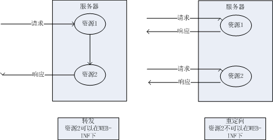

spring mvc底层其实就是一个servlet，因此在spring mvc中也存在转发和重定向的概念。
==对于转发的页面，可以是在WEB-INF目录下的页面；而重定向的页面，是不能在WEB-INF目录下的。因为重定向相当于用户再次发出一次请求，而用户是不能直接访问WEB-INF目录下的资源的。==
根据索要跳转的的资源，可以分为跳转到jsp页面和跳转到其他controller。

转发和重定向区别


## 1 返回ModelAndView
### 1.1 返回ModelAndView时转发
##### 1.1.1 请求转发到另一页面

当controller中的方法返回ModelAndView的时候，默认是使用的转发。当然，我们也可以显式的指出要使用转发，此时，需在 setViewName()指定的视图前添加forward:，此时springmvc.xml文件中配置的视图解析器将会失效，即需要在setViewName中写上jsp相对于项目根的路径。  

```
/**
 * 转发返回ModelAndView对象
 * @return
 * @throws Exception
 */
@RequestMapping("/forwardMAV.do")
public ModelAndView forwardMAV()throws Exception{

    ModelAndView mv = new ModelAndView();
    mv.addObject("type", "转发返回ModelAndView");
    //默认情况下使用转发
    //mv.setViewName("/result");

    //手动显式指定使用转发，此时springmvc.xml配置文件中的视图解析器将会失效
    mv.setViewName("forward:/jsp/result.jsp");
    return mv;
}
```
在webapp目录下添加jsp/result.jsp文件：

```
<%@ page contentType="text/html;charset=UTF-8" language="java" %>
<html>
<head>
    <title>Title</title>
</head>
<body>
${type}
</body>
</html>
```

#### 1.1.2 转发请求到其他controller中
创建OtherController.java

```
/**
 * 被跳转的controller
 */
@Controller
public class OtherController {

    /**
     * 被跳转的controller返回result.jsp
     * @return
     * @throws Exception
     */
    @RequestMapping("/other.do")
    public ModelAndView other()throws Exception{

        ModelAndView mv = new ModelAndView();
        mv.addObject("type", "被跳转的controller");

        mv.setViewName("result");
        return mv;
    }
}
```
配置转发controller

```
@RequestMapping("/forwardMAV.do")
public ModelAndView forwardMAV()throws Exception{

    ModelAndView mv = new ModelAndView();

    //手动显式指定使用转发，此时springmvc.xml配置文件中的视图解析器将会失效
    mv.setViewName("forward:other.do");
    return mv;
}
```

### 1.2 返回ModelAndView重定向
#### 1.2.1 重定向到其他页面
  
如果要实现重定向，则需在setViewName()指定的视图前添加redirect:，此时springmvc.xml文件中配置的视图解析器将会失效，即需要在setViewName中写上jsp相对于项目根的路径。  
重定向的方式在request域中的数据会失效，此时可以通过ModelAndView来传递数据，但是只能传递基本数据类型和String类型，因为spring mvc会将传递的数据以请求参数的方式放到url的后面，此时任何数据类型都会被转换为普通的字符串。另外，我们在jsp中取值的时候需要使用 EL 表达式中的请求参数param读取。  
除此之外，还可以将数据放到HttpSession域中。

```
/**
 * 重定向返回ModelAndView对象
 * @return
 * @throws Exception
 */
@RequestMapping("/redirectMAV.do")
public ModelAndView redirectMAV(School school,String name)throws Exception{

    ModelAndView mv = new ModelAndView();

    //在重定向中可以使用ModelAndView传递数据，但是只能传递基本数据类型和String类型
    mv.addObject("school",school);
    mv.addObject("name", name);

    //使用重定向，此时springmvc.xml配置文件中的视图解析器将会失效
    mv.setViewName("redirect:/jsp/result.jsp");
    return mv;
```
result.jsp

```
<%@ page contentType="text/html;charset=UTF-8" language="java" %>
<html>
<head>
    <title>Title</title>
</head>
<body>

${school.schoolName}<br>
${param.school.address}<br>
<!--借助param获取参数值-->
${param.name}
</body>
</html>
```
==在上面的jsp中只有最后一个才能读取到数据。==

#### 1.2.2 重定向到其他controller

在重定向到其他controller中的方法的时候，只要保证两者的参数名一致即可实现数据的传递。

```
@RequestMapping("/redirectMAV.do")
public ModelAndView redirectMAV(School school,String name)throws Exception{

    ModelAndView mv = new ModelAndView();

    mv.addObject("name", name);
    mv.addObject("schoolName", school.getSchoolName());
    mv.addObject("address", school.getAddress());

    System.out.println(school.getAddress());
    //使用重定向，此时springmvc.xml配置文件中的视图解析器将会失效
    mv.setViewName("redirect:other.do");
    return mv;
}
```
OtherController：

```
@RequestMapping("/other.do")
public ModelAndView other(String name, School school)throws Exception{

    ModelAndView mv = new ModelAndView();

    //单个接收
    mv.addObject("name", name);

    //通过javabean对象接收
    mv.addObject("school", school);

    System.out.println(school.getAddress());
    mv.setViewName("result");

    return mv;
}
```
## 2 返回String类型
### 2.1 返回String类型的转发

这个整体上跟之前ModelAndView差不多，只不过在controller中的方法参数会被自动的放到request域中。  


```
@RequestMapping("/forwardStr.do")
public String forwardStr(School school)throws Exception{

    //默认会使用转发
    //return "result";
    //显式的使用转发
    return "forward:/jsp/result.jsp";
}
```
result.jsp中直接通过request域获取数据，以下两种方式均可。


```
${requestScope.school.schoolName}
${school.schoolName}
```
### 2.2 返回String类型的重定向  

这里要想传递数据的话，需要使用之前介绍过的Model实现，这里的数据同样会放在url中，所以只能传递基本数据类型和String类型。  

```
@RequestMapping("/redirectStr.do")
public String redirectStr(School school, Model model)throws Exception{

    //这里的数据同样会放在url中，所以只能传递基本数据类型和String类型
    model.addAttribute("schoolName", school.getSchoolName());
    model.addAttribute("address", school.getAddress());

    return "redirect:/jsp/result.jsp";
}
```
result.jsp中需要通过param来获取数据：

```
${param.schoolName}
${param.address}
```
这里转发和重定向跟之前返回ModelAndView的时候一样。

## 3 返回void的重定向和转发

当方法没有返回值即返回void的时候，重定向和转发操作都是使用的servlet的api，就是：  
**转发：**
```
request.getRequestDispatcher("/jsp/result.jsp").forward(request, response);
```
**重定向：**

```
response.sendRedirect(request.getContextPath()+"/jsp/result.jsp");
```
