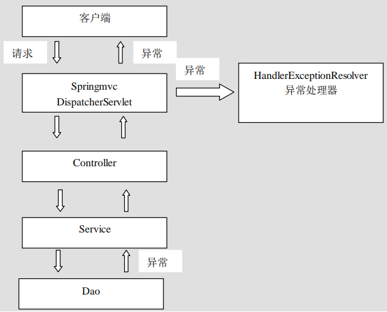

## 异常处理的思路
系统中异常包括两类：预期异常和运行时异常 RuntimeException，前者通过捕获异常从而获取异常信息，
后者主要通过规范代码开发、测试通过手段减少运行时异常的发生。
系统的 dao、service、controller 出现都通过 throws Exception 向上抛出，最后由 springmvc 前端
控制器交由异常处理器进行异常处理，如下图：



## 实现1：自定义异常处理器  
倘若我们要在项目中捕获特定的异常，然后再根据捕获的异常做一些操作的时候，按照以前的写法，我们需要在每次捕获异常之后或者抛出之前进行操作，这段代码就会重复的出现在很多类里面，导致代码冗余，此时，我们可以通过自定义异常处理器来解决。  

**关键**  
- 1、需要实现org.springframework.web.servlet.HandlerExceptionResolver接口   
- 2、在Springmvc.xml配置文件中进行注册。

首先来自定义一个异常实现HandlerExceptionResolver接口，只要有异常发生，都会自动执行接口方法resolveException()。

```java
package com.panda00hi.exception;

import org.springframework.web.servlet.HandlerExceptionResolver;
import org.springframework.web.servlet.ModelAndView;

import javax.servlet.http.HttpServletRequest;
import javax.servlet.http.HttpServletResponse;

/**
 * 自定义异常处理器
 */
public class MyExceptionResolver implements HandlerExceptionResolver {
    /**
     * 只要程序中有异常抛出，那么就会执行该方法。方法会传入各参数，包括Exception ex，可结合instanceof判断ex所属的类型
     * 然后统一进行记录日志等操作，避免了在controller中的冗余
     * @param request
     * @param response
     * @param handler
     * @param ex
     * @return
     */
    @Override
    public ModelAndView resolveException(HttpServletRequest request, HttpServletResponse response, Object handler, Exception ex) {
        ModelAndView mv = new ModelAndView();
        mv.addObject("ex",ex);

        //设置默认异常处理界面
        mv.setViewName("error/error");

        //判断ex对象是否是MyException或其他异常的实例
        if (ex instanceof MyException) {
            //记录日志，或其他操作
            //设置跳转到自定义异常页面
            mv.setViewName("error/myerror");
        } else if (ex instanceof NullPointerException) {
            //记录日志，或其他操作
            //……
        }
        return mv;
    }
}

```
springmvc.xml中注册自定义异常处理器：

```
<bean class="com.panda00hi.exception.MyExceptionResolver"/>
```

## 实现2：使用注解处理异常

使用注解@ExceptionHandler 可以将一个方法指定为异常处理方法，该注解只有一个可选属性value，是一个 Class<?>数组，用于指定该注解的方法所要处理的异常类，当controller中抛出的异常在这个Class数组中的时候才会调用该异常处理方法。  
而被注解的异常处理方法，其返回值可以是 ModelAndView、String，或 void，方法名随意，方法参数可以是 Exception 及其子类对象、HttpServletRequest、HttpServletResponse 等。系统会自动为这些方法参数赋值。

``` JAVA
package com.panda00hi.controller;

import com.panda00hi.exception.MyException;
import org.springframework.stereotype.Controller;
import org.springframework.web.bind.annotation.ExceptionHandler;
import org.springframework.web.bind.annotation.RequestMapping;
import org.springframework.web.servlet.ModelAndView;

/**
 * 使用注解标注异常方法
 */
@Controller
public class AnnotationExceptionController {

    @RequestMapping("/regist.do")
    public ModelAndView regist(String name) throws Exception {

        ModelAndView mv = new ModelAndView();
        if ("jack".equals(name)) {
            throw new MyException("自定义异常");
        }

        return mv;
    }


    /**
     * 处理MyException异常的方法
     * @param ex
     * @return
     */
    @ExceptionHandler(MyException.class)
    public ModelAndView handleMyException(Exception ex) {
        ModelAndView mv = new ModelAndView();
        mv.addObject("ex", ex);
        mv.setViewName("/error/MyError");

        return mv;
    }
}
```
上面使用ExceptionHandler注解标注了一个处理MyException的异常，不过只有在当前的controller中抛出MyException之后才会被该方法处理，其他controller的方法中抛出MyException异常时候是不会被处理的，解决这个问题的办法就是单独定义一个处理异常方法的Controller，然后让其他Controller来继承它，但是这样做的弊端就是继承这个类之后就不能继承其他类了。

定义一个异常处理基类：

```java
package com.panda00hi.controller;

import com.panda00hi.exception.MyException;
import org.springframework.stereotype.Controller;
import org.springframework.web.bind.annotation.ExceptionHandler;
import org.springframework.web.bind.annotation.RequestMapping;
import org.springframework.web.servlet.ModelAndView;

/**
 * 异常处理基类
 */
@Controller
public class BaseExceptionController {


    /**
     * 处理MyException异常的方法
     * @param ex
     * @return
     */
    @ExceptionHandler(MyException.class)
    public ModelAndView handleMyException(Exception ex) {
        ModelAndView mv = new ModelAndView();
        mv.addObject("ex", ex);
        mv.setViewName("/error/MyError");

        return mv;
    }


    /**
     * 其他异常处理，注解中不用写value属性
     * @param ex
     * @return
     */
    @ExceptionHandler
    public ModelAndView handleException(Exception ex) {
        ModelAndView mv = new ModelAndView();
        mv.addObject("ex", ex);
        mv.setViewName("/error/error");

        return mv;
    }
}
```
之后只要让会抛出异常的controller继承上面的BaseExceptionController即可：

``` JAVA
@Controller
@RequestMapping("/user")
public class UserController extends BaseExceptionController {

    @RequestMapping("/addUser.do")
    public ModelAndView addUser(Exception ex,String name) throws Exception{

        ModelAndView mv = new ModelAndView();
        if ("jack".equals(name)) {
            throw new MyException("用户名不能是jack");
        }

        return mv;
    }
}
```
## 实现3：SimpleMappingExceptionResolver
当系统出现异常之后，我们可以让spring mvc跳转到指定的jsp中，这样子对于用户来说体验比较好，对于开发者来说也比较好定位问题，这里先来看下使用SimpleMappingExceptionResolver的方式来处理异常。

首先我们自定义一个异常：

```
package com.panda00hi.exception;

/**
 * 自定义异常
 */
public class MyException extends Exception {

    public MyException() {
        super();
    }

    public MyException(String message) {
        super(message);
    }
}
```
再定义一个controller，在里面分别抛出自定义MyException和jdk自带的Exception：

```
package com.panda00hi.controller;

import com.panda00hi.exception.MyException;
import org.springframework.stereotype.Controller;
import org.springframework.web.bind.annotation.RequestMapping;
import org.springframework.web.servlet.ModelAndView;

/**
 * 异常处理controller
 */
@Controller
public class ExceptionController {

    @RequestMapping("/myException.do")
    public ModelAndView myException(String name) throws Exception {

        ModelAndView mv = new ModelAndView();

        if ("jack".equals(name)) {
            throw new MyException("自定义的异常");
        }
        if (!"jack".equals(name)) {
            throw new Exception("异常");
        }
        return mv;
    }
}

```
接下来需要修改一下springmvc.xml配置文件，添加异常处理相关的配置:

```
<?xml version="1.0" encoding="UTF-8"?>
<beans xmlns="http://www.springframework.org/schema/beans"
       xmlns:xsi="http://www.w3.org/2001/XMLSchema-instance" xmlns:mvc="http://www.springframework.org/schema/mvc"
       xmlns:context="http://www.springframework.org/schema/context"
       xsi:schemaLocation="http://www.springframework.org/schema/beans http://www.springframework.org/schema/beans/spring-beans.xsd http://www.springframework.org/schema/mvc http://www.springframework.org/schema/mvc/spring-mvc.xsd http://www.springframework.org/schema/context http://www.springframework.org/schema/context/spring-context.xsd">


    <!--注解驱动-->
    <mvc:annotation-driven/>
    <!--组件扫描器-->
    <context:component-scan base-package="com.panda00hi.*"/>


    <!--请求仍然会跳转到内部jsp，需要新配置一个-->
    <!--外部视图解析器，放在内部解析器的之前-->
    <bean class="org.springframework.web.servlet.view.BeanNameViewResolver"/>

    <!--定义外部资源view对象，重定向-->
    <bean id="baidu" class="org.springframework.web.servlet.view.RedirectView">
        <!--注意这里的value值要把https://协议部分加上，否则访问的是localhost:8080/www.baidu.com-->
        <property name="url" value="https://www.baidu.com/"/>
    </bean>

    <!--内部视图解析器-->
    <bean class="org.springframework.web.servlet.view.InternalResourceViewResolver">
        <property name="prefix" value="/jsp/"/>
        <property name="suffix" value=".jsp"/>
    </bean>

    <!--异常处理-->
    <bean class="org.springframework.web.servlet.handler.SimpleMappingExceptionResolver">
        <property name="exceptionMappings">
            <props>
                <!--可添加多个自定义异常。error/MyError为要挑战的jsp页面-->
                <prop key="com.panda00hi.exception.MyException">error/myerror</prop>
            </props>
        </property>
        <!--默认的异常跳转页面-->
        <property name="defaultErrorView" value="error/error"/>
        <!--异常信息，在jsp页面中的el表达式可以直接获得value中的值-->
        <property name="exceptionAttribute" value="ex"/>

    </bean>
</beans>
```
配置项说明：

- exceptionMappings：Properties类型属性，用于指定具体的不同类型的异常所对应的异常响应页面。Key 为异常类的全名，value则为响应页面路径，如果配置了视图解析器的话，那会使用视图解析器中的配置。
- defaultErrorView：指定默认的异常响应页面。若发生的异常不是 exceptionMappings 中指定的异常，则使用默认异常响应页面。
- exceptionAttribute：捕获到的异常对象，一般异常响应页面中使用，在el表达式中可以获取到value中的值。


自定义异常响应的页面，在jsp目录中创建error目录，存放异常跳转页面。
自定义异常跳转页面myerror.jsp

```
<%--
  Created by IntelliJ IDEA.
  User: panda
  Date: 2019/4/9
  Time: 14:41
  To change this template use File | Settings | File Templates.
--%>
<%@ page contentType="text/html;charset=UTF-8" language="java" %>
<html>
<head>
    <title>MyError</title>
</head>
<body>
自定义的异常跳转界面<br>
${ex}
</body>
</html>

```
默认异常跳转页面：

```
<%--
  Created by IntelliJ IDEA.
  User: panda
  Date: 2019/4/9
  Time: 14:41
  To change this template use File | Settings | File Templates.
--%>
<%@ page contentType="text/html;charset=UTF-8" language="java" %>
<html>
<head>
    <title>MyError</title>
</head>
<body>
默认的异常跳转界面<br>
${ex}
</body>
</html>

```
启动tomcat，浏览器传递name参数，查看效果：
**http://localhost:8080/demo06/myException.do?name=jack**


**http://localhost:8080/demo06/myException.do?name=notjack**


意义：发生异常时，通过跳转到指定页面，对用户更加友好提示异常信息。
