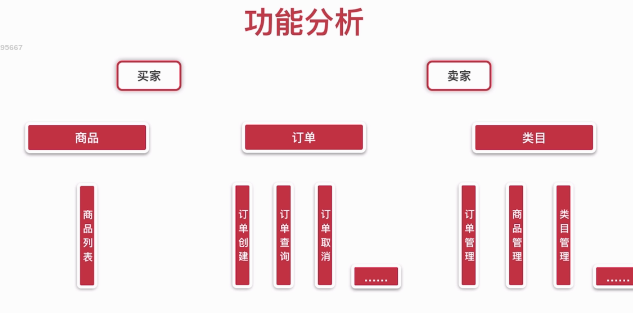
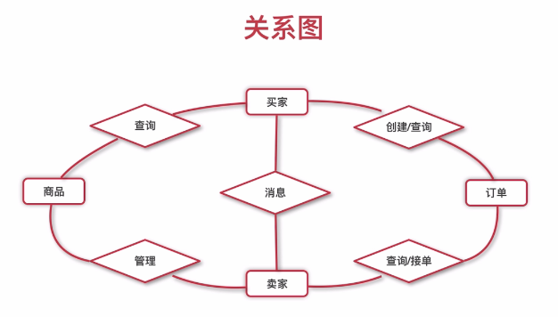
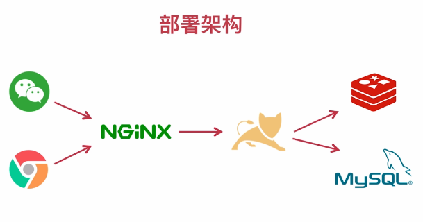
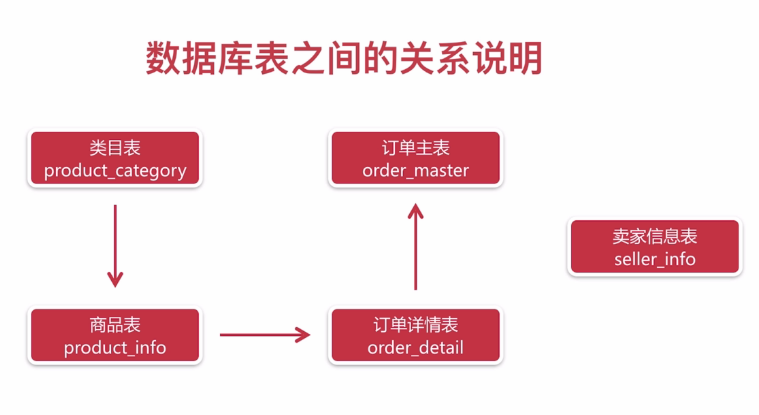

# 2 项目设计
包括：
- 角色划分
- 功能模块划分
- 部署架构
- 数据库设计

## 2.1 项目设计
### 2.1.1 角色划分
买家（手机端）
卖家（PC）

### 2.1.2 功能分析和关系图




### 2.1.3 部署架构


## 2.2 数据库设计

### 2.2.1 数据库表的关系说明


### 2.2.2 各个表的设计

`注意`：
1. 设计表字段时，要考虑选择最合适的类型。
如，类似状态字段等，可以选用`tinyint`，
如果数据量大，那么主键不要用自增类型（int类型），因为自增类型会有上限，当量非常大时，会达到上限。可用varchar字符类型。
==此处保留，貌似不太需要纠结上限的问题。有待进一步研究==

2. 如果需要储存emoj表情等，字符集需要选择utf-8(utf8umb4)，否则会报错【mysql5.7】

### 2.2.3 sql语句

```sql
-- 类目
create table `product_category` (
    `category_id` int not null auto_increment,
    `category_name` varchar(64) not null comment '类目名字',
    `category_type` int not null comment '类目编号',
    `create_time` timestamp not null default current_timestamp comment '创建时间',
    `update_time` timestamp not null default current_timestamp on update current_timestamp comment '修改时间',
    primary key (`category_id`),
    UNIQUE KEY `uqe_category_type` (`category_type`)
);

-- 商品
create table `product_info` (
    `product_id` varchar(32) not null,
    `product_name` varchar(64) not null comment '商品名称',
    `product_price` decimal(8,2) not null comment '单价',
    `product_stock` int not null comment '库存',
    `product_description` varchar(64) comment '描述',
    `product_icon` varchar(512) comment '小图',
    `product_status` tinyint(3) DEFAULT '0' COMMENT '商品状态,0正常1下架',
    `category_type` int not null comment '类目编号',
    `create_time` timestamp not null default current_timestamp comment '创建时间',
    `update_time` timestamp not null default current_timestamp on update current_timestamp comment '修改时间',
    primary key (`product_id`)
);

-- 订单
create table `order_master` (
    `order_id` varchar(32) not null,
    `buyer_name` varchar(32) not null comment '买家名字',
    `buyer_phone` varchar(32) not null comment '买家电话',
    `buyer_address` varchar(128) not null comment '买家地址',
    `buyer_openid` varchar(64) not null comment '买家微信openid',
    `order_amount` decimal(8,2) not null comment '订单总金额',
    `order_status` tinyint(3) not null default '0' comment '订单状态, 默认为新下单',
    `pay_status` tinyint(3) not null default '0' comment '支付状态, 默认未支付',
    `create_time` timestamp not null default current_timestamp comment '创建时间',
    `update_time` timestamp not null default current_timestamp on update current_timestamp comment '修改时间',
    primary key (`order_id`),
    key `idx_buyer_openid` (`buyer_openid`)
);

-- 订单商品
create table `order_detail` (
    `detail_id` varchar(32) not null,
    `order_id` varchar(32) not null,
    `product_id` varchar(32) not null,
    `product_name` varchar(64) not null comment '商品名称',
    `product_price` decimal(8,2) not null comment '当前价格,单位分',
    `product_quantity` int not null comment '数量',
    `product_icon` varchar(512) comment '小图',
    `create_time` timestamp not null default current_timestamp comment '创建时间',
    `update_time` timestamp not null default current_timestamp on update current_timestamp comment '修改时间',
    primary key (`detail_id`),
    key `idx_order_id` (`order_id`)
);

-- 卖家(登录后台使用, 卖家登录之后可能直接采用微信扫码登录，不使用账号密码)
create table `seller_info` (
    `seller_id` varchar(32) not null,
    `username` varchar(32) not null,
    `password` varchar(32) not null,
    `openid` varchar(64) not null comment '微信openid',
    `create_time` timestamp not null default current_timestamp comment '创建时间',
    `update_time` timestamp not null default current_timestamp on update current_timestamp comment '修改时间',
    primary key (`seller_id`)
) comment '卖家信息表';

```


