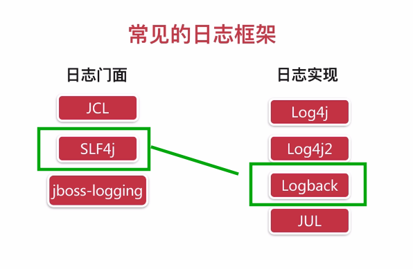
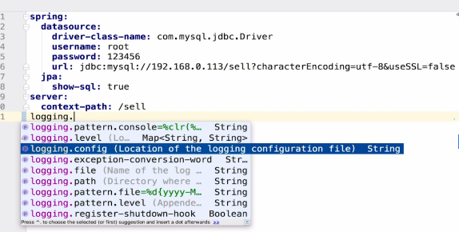

# 3 项目起步

## 3.1 开发环境搭建

springboot项目

## 3.2 日志的使用

* 什么是日志框架
* 日志框架的选择
* Logback的使用与配置

### 3.2.1 框架介绍 

#### 日志框架作用：

1. 能够实现日志输出的工具包
2. 能够描述系统运行状态的所有事件可以作为日志，如用户下线、接口超时、数据库崩溃等。

#### 日志框架的能力

1. 定制输出目标：
2. 定制输出格式：
3. 携带上下文信息：
4. 运行时选择性输出：
5. 灵活的配置：
6. 优异的性能：

#### 常见的日志框架

优选：



### 3.2.2 集成到项目中并使用

项目中，test目录下，新建测试类LoggerTest.java

``` JAVA
package com.imooc.sell;

import org.junit.Test;
import org.junit.runner.RunWith;
import org.slf4j.Logger;
import org.slf4j.LoggerFactory;
import org.springframework.boot.test.context.SpringBootTest;
import org.springframework.test.context.junit4.SpringRunner;

/**
 * @author panda00hi
 * 2020/2/21
 */
@RunWith(SpringRunner.class)
@SpringBootTest
public class LoggerTest {

    private final Logger logger = LoggerFactory.getLogger(LoggerTest.class);

    @Test
    public void test1() {
        logger.debug("debug...");
        logger.info("info...");
        logger.error("error...");
    }
}

```

运行test1方法，即可看到控制台的结果输出。

#### 问题解决

1. spring 的Junit报异常：no runnerable method

解决：导错包。应该是 `import org.junit.Test;` 
而不是 `import org.junit.jupiter.api.Test;` 

2. 无法使用@RunWith(SpringRunner.class)注解

解决：缺少依赖。到pom.xml文件中导入依赖即可。

``` xml
<dependency>
            <groupId>junit</groupId>
            <artifactId>junit</artifactId>
            <scope>test</scope>
        </dependency>
```

3. 使用@Slf4j简化时，已经添加了lombok依赖，但是使用log调用时报错。

解决：idea要安装Lombok插件。安装完成重启即可生效。

### 3.2.3 Logback的配置
- application.yml
- logback-spring.xml


#### 实现特定需求的示例：
例如有如下需求：
- 区分info和error日志
- 每天产生一个日志文件

1. 修改yml配置文件



